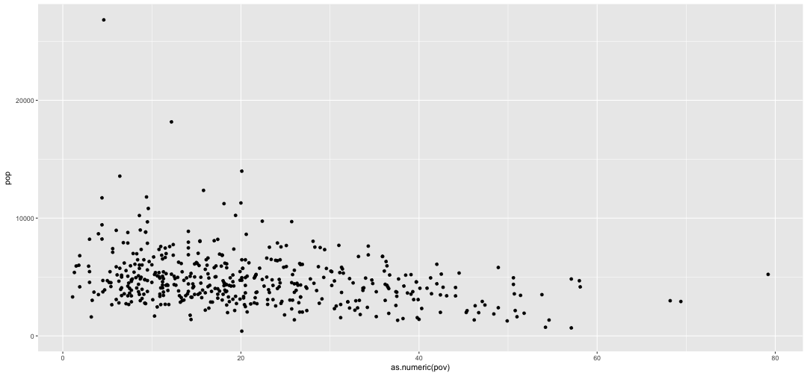

The tidyverse
========================================================
author: Jorge Cimentada  
date: 16th of February of 2017  
class: illustration
font-family: 'Helvetica'
width: 1440
height: 900

The philosophy of the tidyverse
========================================================
incremental: true

- What is the tidyverse?

- "The tidyverse is a set of packages that work in harmony because they share common data representations." Hadley Wickham

- They've been created with the same data process in mind.

Remember R packages have been created by thousands of users without a clear structure!

The tidyverse is one attempt at unifying the philosophy of data analysis.

The philosophy of the tidyverse
=======================================================

Yeah, the tidyverse is really just a package that installs other packages:

"The tidyverse package is designed to make it easy to install and load core packages from the tidyverse in a single command." Hadley Wickham  


```r
install.packages("tidyverse")
```

The philosophy of the tidyverse
=======================================================

What is the tidyverse for?

"My goal is to make the  data analysis process a pit of success" Hadley Wickham


<div align="left">

</div>

<small>http://r4ds.had.co.nz/introduction.html</small>

The philosophy of the tidyverse
======================================================

<div align="center">

</div>

The philosophy of the tidyverse
======================================================

- Why TIDYverse?

- Why tidyVERSE?

First..
=======================================================

```r
library(tidyverse)
```

Data visualization
========================================================


```
# A tibble: 173 × 11
   major_code                                 major
        <int>                                 <chr>
1        1100                   GENERAL AGRICULTURE
2        1101 AGRICULTURE PRODUCTION AND MANAGEMENT
3        1102                AGRICULTURAL ECONOMICS
4        1103                       ANIMAL SCIENCES
5        1104                          FOOD SCIENCE
6        1105            PLANT SCIENCE AND AGRONOMY
7        1106                          SOIL SCIENCE
8        1199             MISCELLANEOUS AGRICULTURE
9        1301                 ENVIRONMENTAL SCIENCE
10       1302                              FORESTRY
# ... with 163 more rows, and 9 more variables: major_category <chr>,
#   total <int>, employed <int>, employed_full_time_year_round <int>,
#   unemployed <int>, unemployment_rate <dbl>, median <int>, p25th <int>,
#   p75th <dbl>
```

Data visualization
========================================================
ggplot structure:


```r
ggplot(data = college_all_ages) +
  geom_point(mapping = aes(x = median, y = total))
```



Data visualization
========================================================

The `ggplot` function "opens" the data and the `geom` function specifies the type of plot with the variables that will be used.

The general structure is like this:


```r
ggplot(data = <DATA>) + 
  <GEOM_FUNCTION>(mapping = aes(<MAPPINGS>))
```

Data visualization
========================================================

How many geoms (plots)?

- `geom_point()`
- `geom_bar()`
- `geom_histogram()`
- `geom_boxplot()`
- `geom_density()`
- `geom_line()`
- `geom_smooth()`
- And a bunch more  

[all geoms](http://sape.inf.usi.ch/quick-reference/ggplot2/geom)  
[all ggplot2 extensions](http://www.ggplot2-exts.org/gallery/)

Data visualization
========================================================

Let's look at the data again..


```
# A tibble: 173 × 11
   major_code                                 major
        <int>                                 <chr>
1        1100                   GENERAL AGRICULTURE
2        1101 AGRICULTURE PRODUCTION AND MANAGEMENT
3        1102                AGRICULTURAL ECONOMICS
4        1103                       ANIMAL SCIENCES
5        1104                          FOOD SCIENCE
6        1105            PLANT SCIENCE AND AGRONOMY
7        1106                          SOIL SCIENCE
8        1199             MISCELLANEOUS AGRICULTURE
9        1301                 ENVIRONMENTAL SCIENCE
10       1302                              FORESTRY
# ... with 163 more rows, and 9 more variables: major_category <chr>,
#   total <int>, employed <int>, employed_full_time_year_round <int>,
#   unemployed <int>, unemployment_rate <dbl>, median <int>, p25th <int>,
#   p75th <dbl>
```

Data visualization
========================================================


```r
# colour
ggplot(data = college_all_ages) +
  geom_point(mapping = aes(x = median, y = total, colour = major_category))

# size
ggplot(data = college_all_ages) +
  geom_point(mapping = aes(x = median, y = total, size = major_category))

# shape
ggplot(data = college_all_ages) +
  geom_point(mapping = aes(x = median, y = total, shape = major_category))

# alpha (transparency)
ggplot(data = college_all_ages) +
  geom_point(mapping = aes(x = median, y = total, colour = unemployment_rate))
```
