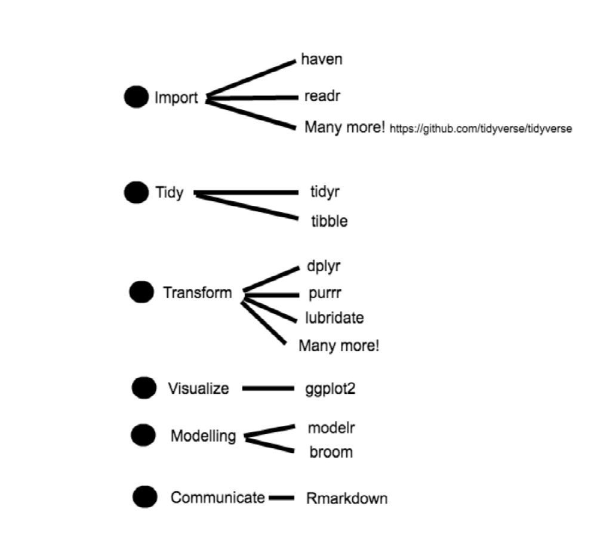
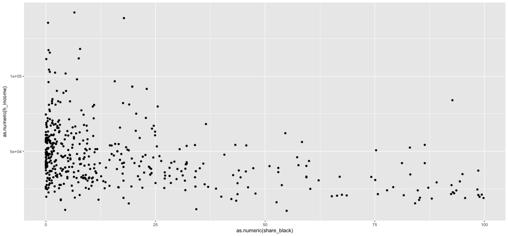
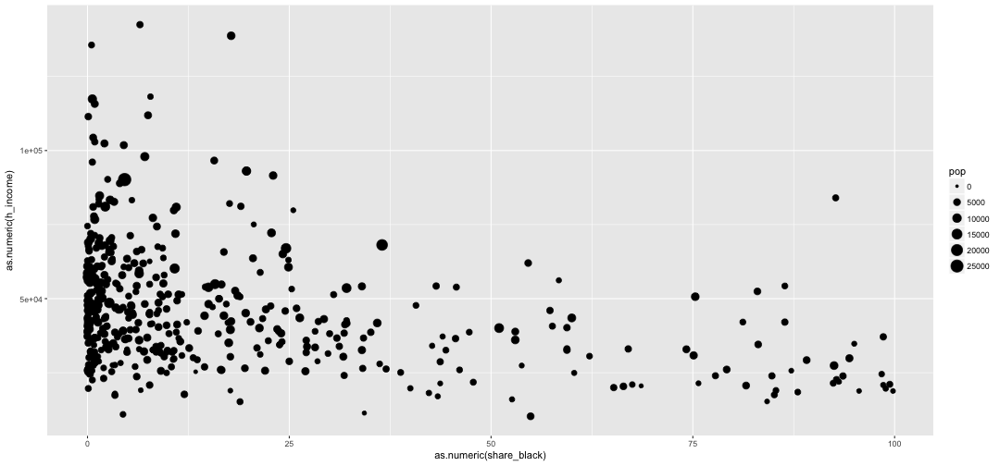
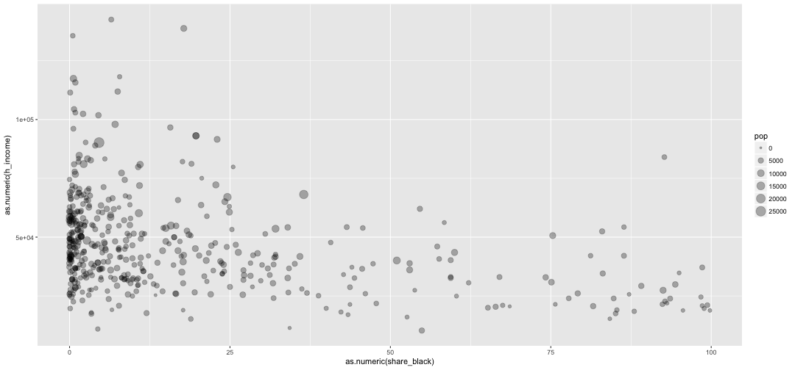
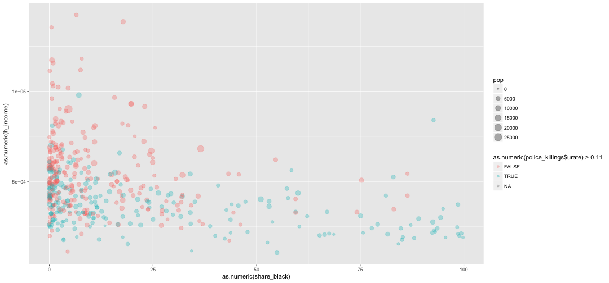
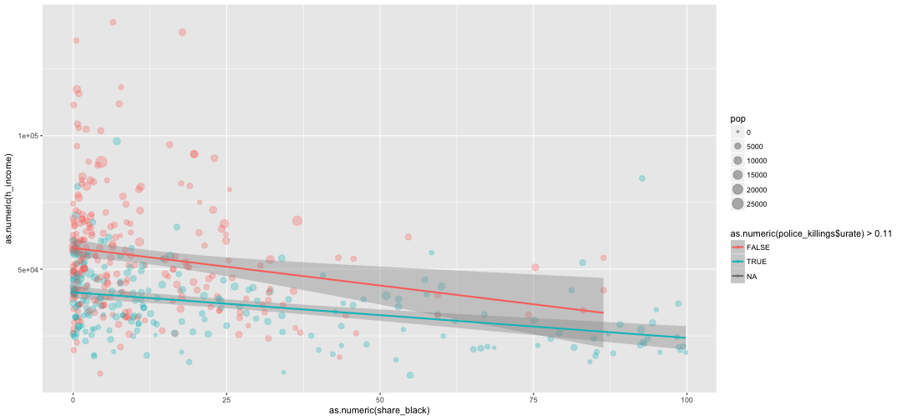
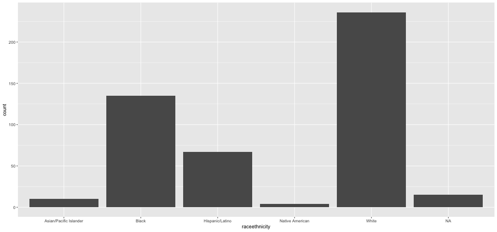
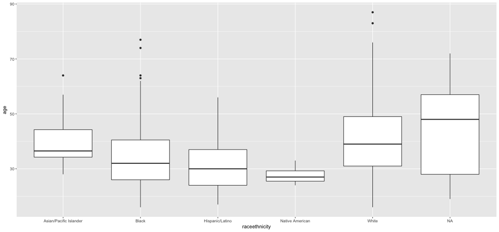
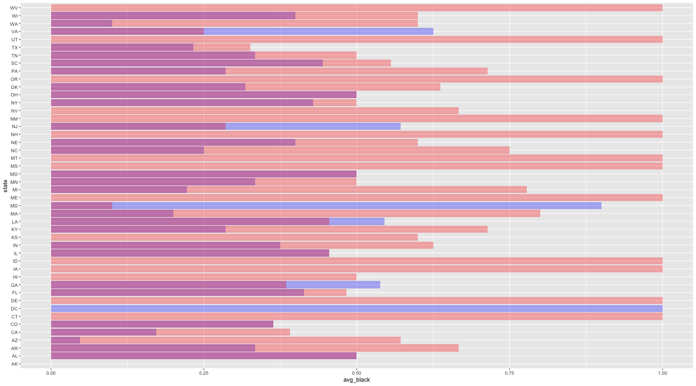

The tidyverse
========================================================
author: Jorge Cimentada  
date: 16th of February of 2017  
class: illustration
font-family: 'Helvetica'
width: 1800
height: 900

The philosophy of the tidyverse 
========================================================
incremental: true


- What is the tidyverse?

- "The tidyverse is a set of packages that work in harmony because they share common data representations." Hadley Wickham

- They've been created with the same data process in mind.

Remember R packages have been created by thousands of users without a clear structure!

The tidyverse is one attempt at unifying the philosophy of data analysis.

The philosophy of the tidyverse
=======================================================

Yeah, the tidyverse is really just a package that installs other packages:

"The tidyverse package is designed to make it easy to install and load core packages from the tidyverse in a single command." Hadley Wickham  


```r
install.packages("tidyverse")
```

The philosophy of the tidyverse
=======================================================

What is the tidyverse for?

"My goal is to make the  data analysis process a pit of success" Hadley Wickham


<div align="left">

</div>

<small>http://r4ds.had.co.nz/introduction.html</small>

The philosophy of the tidyverse
======================================================

<div align="center">

</div>

The philosophy of the tidyverse
======================================================

- Why TIDYverse?

- Why tidyVERSE?

First..
=======================================================

```r
library(tidyverse)
```

Data visualization
========================================================


```r
library(tidyverse)
library(fivethirtyeight)
police_killings
```

```
# A tibble: 467 × 34
                 name   age gender   raceethnicity    month   day  year
                <chr> <int>  <chr>           <chr>    <chr> <int> <int>
1  A'donte Washington    16   Male           Black February    23  2015
2      Aaron Rutledge    27   Male           White    April     2  2015
3         Aaron Siler    26   Male           White    March    14  2015
4        Aaron Valdez    25   Male Hispanic/Latino    March    11  2015
5        Adam Jovicic    29   Male           White    March    19  2015
6       Adam Reinhart    29   Male           White    March     7  2015
7    Adrian Hernandez    22   Male Hispanic/Latino    March    27  2015
8        Adrian Solis    35   Male Hispanic/Latino    March    26  2015
9       Alan Alverson    44   Male           White  January    28  2015
10         Alan James    31   Male           White February     7  2015
# ... with 457 more rows, and 27 more variables: streetaddress <chr>,
#   city <chr>, state <chr>, latitude <dbl>, longitude <dbl>,
#   state_fp <int>, county_fp <int>, tract_ce <int>, geo_id <dbl>,
#   county_id <int>, namelsad <chr>, lawenforcementagency <chr>,
#   cause <chr>, armed <chr>, pop <int>, share_white <chr>,
#   share_black <chr>, share_hispanic <chr>, p_income <chr>,
#   h_income <chr>, county_income <int>, comp_income <chr>,
#   county_bucket <chr>, nat_bucket <chr>, pov <chr>, urate <chr>,
#   college <chr>
```

Data visualization
========================================================
ggplot structure:


```r
ggplot(data = police_killings) +
  geom_point(mapping = aes(x = as.numeric(pov), y = pop))
```


Data visualization
========================================================

The `ggplot` function "opens" the data and the `geom` function specifies the type of plot with the variables that will be used.

The general structure is like this:


```r
ggplot(data = <DATA>) + 
  <GEOM_FUNCTION>(mapping = aes(<MAPPINGS>))
```

Data visualization
========================================================

How many geoms (plots)?

- `geom_point()`
- `geom_bar()`
- `geom_histogram()`
- `geom_boxplot()`
- `geom_density()`
- `geom_line()`
- `geom_smooth()`
- And a bunch more  

[all geoms](http://sape.inf.usi.ch/quick-reference/ggplot2/geom)  
[all ggplot2 extensions](http://www.ggplot2-exts.org/gallery/)

Data visualization
========================================================

Let's look at the data again..


```
# A tibble: 467 × 34
                 name   age gender   raceethnicity    month   day  year
                <chr> <int>  <chr>           <chr>    <chr> <int> <int>
1  A'donte Washington    16   Male           Black February    23  2015
2      Aaron Rutledge    27   Male           White    April     2  2015
3         Aaron Siler    26   Male           White    March    14  2015
4        Aaron Valdez    25   Male Hispanic/Latino    March    11  2015
5        Adam Jovicic    29   Male           White    March    19  2015
6       Adam Reinhart    29   Male           White    March     7  2015
7    Adrian Hernandez    22   Male Hispanic/Latino    March    27  2015
8        Adrian Solis    35   Male Hispanic/Latino    March    26  2015
9       Alan Alverson    44   Male           White  January    28  2015
10         Alan James    31   Male           White February     7  2015
# ... with 457 more rows, and 27 more variables: streetaddress <chr>,
#   city <chr>, state <chr>, latitude <dbl>, longitude <dbl>,
#   state_fp <int>, county_fp <int>, tract_ce <int>, geo_id <dbl>,
#   county_id <int>, namelsad <chr>, lawenforcementagency <chr>,
#   cause <chr>, armed <chr>, pop <int>, share_white <chr>,
#   share_black <chr>, share_hispanic <chr>, p_income <chr>,
#   h_income <chr>, county_income <int>, comp_income <chr>,
#   county_bucket <chr>, nat_bucket <chr>, pov <chr>, urate <chr>,
#   college <chr>
```

Data visualization
========================================================


```r
police_killings$pov <- as.numeric(police_killings$pov)
police_killings$p_income <- as.numeric(police_killings$p_income)

# colour
ggplot(data = police_killings) +
  geom_point(mapping = aes(x = pov, y = pop,
                           colour = p_income > mean(p_income, na.rm = T)))

# size
ggplot(data = police_killings) +
  geom_point(mapping = aes(x = pov, y = pop,
                           size = as.numeric(urate)))

# shape
ggplot(data = police_killings) +
  geom_point(mapping = aes(x = pov, y = pop,
                           shape = p_income > mean(p_income, na.rm = T)))

# alpha (transparency)
ggplot(data = police_killings) +
  geom_point(mapping = aes(x = pov, y = pop,
                           alpha = p_income > mean(p_income, na.rm = T)))
```

Data visualization
========================================================

All of these aesthetics can be used outside the `aes()` wrapper.


```r
# colour
ggplot(data = police_killings) +
  geom_point(mapping = aes(x = pov, y = pop), colour = "blue")

# size
ggplot(data = police_killings) +
  geom_point(mapping = aes(x = pov, y = pop), size = 2.5)

# shape
ggplot(data = police_killings) +
  geom_point(mapping = aes(x = pov, y = pop), shape = 24)

# alpha (transparency)
ggplot(data = police_killings) +
  geom_point(mapping = aes(x = pov, y = pop), alpha = 0.2)
```

Data visualization
========================================================

Aesthetics vary by `geom_*()` functions so you should have a look at the documentation before using it.

- `alpha`
- `colour`
- `fill`
- `group`
- `shape`
- `size`
- `stroke`

Are common ones..

Data visualization
========================================================

Let's try it out:

We want to create a scatterplot to look at the relationship between the % of black within the county and the median household income. This will help to establish whether counties with black majority are associated with lower household income.

Hints:
- x var = `as.numeric(share_black)`
- y var = `as.numeric(h_income)`
- data name = `police_killings`
- geom = `geom_point()`


Data visualization
========================================================

Answer:


```r
ggplot(data = police_killings) +
  geom_point(aes(x = as.numeric(share_black),
                 y = as.numeric(h_income)))
```



Data visualization
========================================================

Let's add the size of the points to be a function of the population in the county.

Hints:
- aesthetic = `size`
- variable = `pop`

Data visualization
========================================================

Answer:


```r
ggplot(data = police_killings) +
  geom_point(aes(x = as.numeric(share_black),
                 y = as.numeric(h_income), size = pop))
```



Too many dots! It doesn't look that nice. Let's add `alpha = 0.3`

Data visualization
========================================================

Answer:


```r
ggplot(data = police_killings) +
  geom_point(aes(x = as.numeric(share_black),
                 y = as.numeric(h_income),
                 size = pop),
             alpha = 0.30)
```



Data visualization
========================================================

Let's color counties based on whether they are above/below the mean unemployment rate which is 0.11:

Hint:
- aesthetic = `colour` or `color`
- variable = `as.numeric(police_killings$urate) > 0.11`

Data visualization
========================================================

Answer:


```r
ggplot(data = police_killings) +
  geom_point(aes(x = as.numeric(share_black),
                 y = as.numeric(h_income),
                 size = pop,
                 colour = as.numeric(police_killings$urate) > 0.11),
             alpha = 0.30)
```




Data visualization
========================================================

Let's move everything to the `ggplot()` call


```r
ggplot(data = police_killings,
       aes(x = as.numeric(share_black),
                 y = as.numeric(h_income),
                 size = pop,
                 colour = as.numeric(police_killings$urate) > 0.11)) +
  geom_point(alpha = 0.30)
```


Data visualization
========================================================

Finally, let's add the a regression line for each group:


```r
ggplot(data = police_killings,
       aes(x = as.numeric(share_black),
           y = as.numeric(h_income),
           colour = as.numeric(police_killings$urate) > 0.11)) +
  geom_point(aes(size = pop), alpha = 0.30) +
  geom_smooth(method = "lm")
```



So much done with just a few lines!

Data visualization
========================================================

Other graphs:


```r
ggplot(police_killings, aes(x = age)) +
  geom_histogram(bins = 55)
```


Data visualization
========================================================

Other graphs:


```r
ggplot(police_killings, aes(x = raceethnicity)) +
  geom_bar()
```



Data visualization
========================================================

Other graphs:


```r
ggplot(police_killings, aes(x = raceethnicity, y = age)) +
  geom_boxplot()
```



Data visualization
========================================================

It's not far fetched to say that this is truly the surface of what ggplot2 can do.
To learn ggplot2:

[R graph coobook](http://www.cookbook-r.com/Graphs/)  
[ggplot2 book by its author](http://ggplot2.org/book/)  
[R for Data Science](http://r4ds.had.co.nz/)  

* But also wait for the third seminar given by Robert ;)

The pipe
========================================================

This is the pipe: %>%

* PICTURE OF THE PIPE

The pipe
========================================================
This is a typical data manipulation workflow in R:


```r
police_killings$year_born <- police_killings$year - police_killings$age

police_killings <- police_killings[police_killings$raceethnicity == "White", ]

with(police_killings, aggregate(age ~ gender, FUN = mean, na.rm = T))
```

```
  gender      age
1 Female 37.72727
2   Male 40.62946
```


The pipe
========================================================


```r
data("police_killings")

police_killings %>%
  mutate(year_born = year - age) %>%
  filter(raceethnicity == "White") %>%
  summarise(mean = mean(age, na.rm = T))
```

```
# A tibble: 1 × 1
      mean
     <dbl>
1 40.49362
```

The pipe
========================================================

Base R:


```r
police_killings$year_born <- police_killings$year - police_killings$age
police_killings <- police_killings[police_killings$raceethnicity == "White", ]
with(police_killings, aggregate(age ~ gender, FUN = mean, na.rm = T))
```

dplyr:


```r
police_killings %>%
  mutate(year_born = year - age) %>%
  filter(raceethnicity == "White") %>%
  summarise(mean = mean(age, na.rm = T))
```

The pipe
============================================================

* x %>% f is equivalent to f(x)

* The pipe carries the previous result into the next function

* Best thing: you didn't have to create an object

* This mantains a logical and clean workflow


============================================================

# Data transformation with dplyr


Data transformation with dplyr
============================================================

`dplyr` is a package to do data manipulation or data wrangling.

Data transformation with dplyr
============================================================

dplyr contains 'verbs' which makes data manipulation very intuitive.

These are:

* `mutate()`
* `select()`
* `filter()`
* `arrange()`
* `group_by()`
* `summarise()`
* `rename()`

Data transformation with dplyr
============================================================

They are so intuitive that even reading them can tell you what they do:


```r
police_killings %>%
  rename(ethnicity = raceethnicity) %>%
  select(gender, age, year, ethnicity, city) %>%
  mutate(year_born = age - year) %>%
  group_by(gender, ethnicity) %>%
  filter(gender == "Male") %>%
  summarise(average_age = mean(age, na.rm = T)) %>%
  arrange(average_age)
```

```
Source: local data frame [6 x 3]
Groups: gender [1]

  gender              ethnicity average_age
   <chr>                  <chr>       <dbl>
1   Male        Native American    27.75000
2   Male        Hispanic/Latino    31.81538
3   Male                  Black    34.16406
4   Male Asian/Pacific Islander    38.22222
5   Male                  White    40.62946
6   Male                   <NA>    46.41667
```

Can you tell what I'm doing?

Data transformation with dplyr
============================================================

Verb structure:


```r
select(.data, variable_name, variable_name)

mutate(.data, new_name = contents, other_new_var = contents)

group_by(.data, variable_name, variable_name)

filter(.data, logical_statement, other_logical_statemente)

summarise(.data, new_var = contents, new_var = contets)

arrange(.data, var_to_sort_by, var_to_sort_by)
```


============================================================

# All of these functions accept and return a data frame!

Data transformation with dplyr
============================================================

Let's construct an expression ourselves.

First, let's pipe the data frame `police_killings` and change the name of `raceethnicity` to `ethnicity` using the `rename()` verb. Remember, the new variable name comes before the `=` and the old variable name comes after the `=`.

Data transformation with dplyr
============================================================


```r
police_killings %>%
  rename(ethnicity = raceethnicity)
```

## What do we get back?

Extend the pipeline to `filter()` only `Male` from the variable `gender` ( Hint: `gender should equal "Male"`). After that, pipe the call to `group_by()` the state.

Data transformation with dplyr
============================================================


```r
police_killings %>%
  rename(ethnicity = raceethnicity) %>%
  filter(gender == "Male") %>%
  group_by(state)
```

## What do we get back?

- Extend the pipeline by using the `summarise()` function and create the new variable `avg_black` and `avg_white` which calculates the proportion of black and white deaths for each state.

### I know this one might be hard but at least reason about it!

Data transformation with dplyr
============================================================


```r
police_killings %>%
  rename(ethnicity = raceethnicity) %>%
  filter(gender == "Male") %>%
  group_by(state) %>%
  summarise(avg_white = mean(ethnicity == "White", na.rm = T),
            avg_black = mean(ethnicity == "Black", na.rm = T))
```

## What do we get back?

- Finally, `arrange()` the new data set by the `avg_black()` variable

Data transformation with dplyr
============================================================


```r
police_killings %>%
  rename(ethnicity = raceethnicity) %>%
  filter(gender == "Male") %>%
  group_by(state) %>%
  summarise(avg_white = mean(ethnicity == "White", na.rm = T),
            avg_black = mean(ethnicity == "Black", na.rm = T)) %>%
  arrange(avg_black)
```

## What do we get back?

Data transformation with dplyr
============================================================


```
# A tibble: 46 × 3
   state avg_white avg_black
   <chr>     <dbl>     <dbl>
1     AK       0.0         0
2     CT       1.0         0
3     DE       1.0         0
4     HI       0.5         0
5     IA       1.0         0
6     ID       1.0         0
7     KS       0.6         0
8     ME       1.0         0
9     MS       1.0         0
10    MT       1.0         0
# ... with 36 more rows
```

Data transformation with dplyr
============================================================

Here's when the strength of the `tidyverse` becomes obvious. We've used the `dplyr` tools to create a summarised dataset. This dataset is informative but we need to visualize it.

## Can you think how we can connect the dplyr tools with the ggplot tools?

Data transformation with dplyr
============================================================

This is one way of plotting the previous data.

```r
ggplot(summary_police) +
  geom_col(aes(state, avg_black), fill = "blue", alpha = 0.3) +
  geom_col(aes(state, avg_white), fill = "red", alpha = 0.3) +
  coord_flip()
```

We specify the `data` name and we'll add two layers of bar graphs, one showing the proportion of black deaths and the other the proportion of white deaths for each state. Because both barplots will overlap, we add a certain degree of transparency so we can spot differences.

Data transformation with dplyr
============================================================



Data transformation with dplyr
============================================================

How do we connect both expressions?

## The PIPE at the rescue

Data transformation with dplyr
============================================================


```r
police_killings %>%
  rename(ethnicity = raceethnicity) %>%
  filter(gender == "Male") %>%
  group_by(state) %>%
  summarise(avg_white = mean(ethnicity == "White", na.rm = T),
            avg_black = mean(ethnicity == "Black", na.rm = T)) %>%
  arrange(avg_black) %>%
  ggplot() +
  geom_col(aes(state, avg_black), fill = "blue", alpha = 0.3) +
  geom_col(aes(state, avg_white), fill = "red", alpha = 0.3) +
  coord_flip()
```

Benefits of this workflow:
- Intuitive verb names
- Easy to read from left to right
- No OBJECTS were created in the process
- Allows you to think about your questions rather than on programming


Data import with haven and readr
============================================================


```r
library(readr)
library(haven)
library(readxl)

read_csv() # CSV, comma delimited
read_stata() # Stata file: supports versions 8-14.
read_spss() # SPSS (.sav) files
read_sas() # SAS files
read_excel() # Read .xls or .xlsx
```

Data import with haven and readr
============================================================

- Package DBI (e.g. RMySQL, RSQLite, RPostgreSQL etc) allows you to run SQL queries against a database and return a data frame.

- For hierarchical data: use `jsonlite` (by Jeroen Ooms) for json, and `xml2` for XML. Jenny Bryan has some excellent worked examples at https://jennybc.github.io/purrr-tutorial/examples.html.

Data import with haven and readr
============================================================


```r
library(readr)
dir_link <- "https://raw.githubusercontent.com/fivethirtyeight/data/master/police-killings/police_killings.csv"

police_killings <- read_csv(dir_link)
```

Let's put everything together
============================================================


```r
library(tidyverse)
library(readr)

dir_link <- "https://raw.githubusercontent.com/fivethirtyeight/data/master/police-killings/police_killings.csv"

police_killings <- read_csv(dir_link)

police_killings %>%
  rename(ethnicity = raceethnicity) %>%
  filter(gender == "Male") %>%
  group_by(state) %>%
  summarise(avg_white = mean(ethnicity == "White", na.rm = T),
            avg_black = mean(ethnicity == "Black", na.rm = T)) %>%
  arrange(avg_black) %>%
  ggplot() +
  geom_col(aes(state, avg_black), fill = "blue", alpha = 0.3) +
  geom_col(aes(state, avg_white), fill = "red", alpha = 0.3) +
  coord_flip()
```

Rstudio workflow
============================================================

Yes, HOMEWORK:
http://r4ds.had.co.nz/workflow-projects.html

============================================================

# Thanks!
## cimentadaj@gmail.com
- If you want to be in our mailing list
- Also, send feedback or want to propose a lecture/seminar

<div align="center">

</div>
