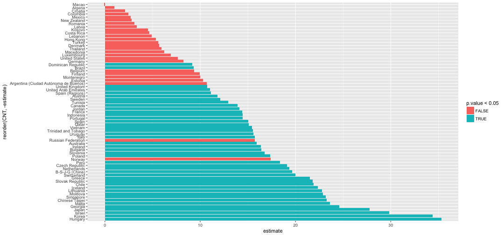

Automating everything: we should always strive for it!
========================================================
author: Jorge Cimentada  
date: 9th of March 2017  
class: illustration
font-family: 'Helvetica'
width: 1800
height: 900


Functions in R
========================================================


```r
my_name <- function(first_name, last_name) {
  paste(first_name, last_name, collapse = "")
}

my_name("Jorge", "Cimentada")
```

```
[1] "Jorge Cimentada"
```
  
- You need to pick a name for the function.
- You list the inputs, or arguments, to the function inside function.
- You place the code you have developed in body of the function.  


#### When should you write a function?
Write a function whenever you’ve copied and pasted a block of code more than twice.

Functions in R
========================================================

Functions can be used within other functions:


```r
my_profile <- function(first_name, last_name, age) {
  paste(my_name(first_name, last_name), "is", age, "years old", collapse = "")
}

my_profile("Jorge", "Cimentada", 26)
```

```
[1] "Jorge Cimentada is 26 years old"
```

Functions in R
========================================================

There are a couple of rules that you need to follow when creating functions.

- Everything that happens inside a function (almost) always stays inside a function


```r
random_num_generator <- function() {
  x <- rnorm(100)
  y <- rnorm(100)
  
  plot(x, y)
}

random_num_generator()
```


Run this and try searching for `x` or `y` inside your working directory.

Functions in R
========================================================

Everytime you call a function, everything that is created inside the function belongs to that functions environment.

Our GlobalEnvironment

```r
environment()
```

```
<environment: R_GlobalEnv>
```

The environment inside a function (randomly generated)

```r
function_env <- function() {
  environment()
}

function_env()
```

```
<environment: 0x7fa9c2e52108>
```

After the function ends the new environment is automatically destroyed.

Functions in R
========================================================

Functions created in an interactive R session are stored by default in the `Global Environment`.


```r
our_useless_fun <- function() {
  "Our random function"
}
environment(our_useless_fun)
```

```
<environment: R_GlobalEnv>
```

How can you tell whether something is a function?


```r
class(our_useless_fun)
```

```
[1] "function"
```

```r
class(our_useless_fun())
```

```
[1] "character"
```

Functions in R
========================================================
**Name masking**

Remember this function?

```r
random_num_generator <- function() {
  x <- rnorm(100)
  y <- rnorm(100)
  
  plot(x, y)
}
```

- The function will search for `x` and `y` inside the functions environment.
- If it doesn't find it, it will look for the function in the next environment _higher_ up.

Functions in R
========================================================


```r
x <- rnorm(100)
random_num_generator <- function() {
  y <- rnorm(100)
  plot(x, y)
}
random_num_generator()
```


### How is the function doing the look up of the variables?

Functions in R
========================================================

Even harder:


```r
set.seed(1)
random_num_generator <- function() { 
  x <- rnorm(100)
  
  function() {
  y <- rnorm(100)
  plot(x, y)
  }
}

m <- random_num_generator()
m()
```

- Do we get an error?
- Whats the output like?

Functions in R
========================================================

Try this one:


```r
set.seed(1)
random_num_generator <- function() { 
  x <- rnorm(100)
  
  function() {
  y <- rnorm(100)
  }
  
  plot(x, y)
}

random_num_generator()
```

- Do we get an error?
- Whats the output like?

Functions in R
========================================================

Try this one:


```r
set.seed(1)
random_num_generator <- function() { 
  x <- rnorm(100)
  y <- rnorm(100)
  
  our_plot <- function() {
  plot(x, y)
  }
  
  our_plot()
}

random_num_generator()
```

- Do we get an error?
- Whats the output like?

Functions in R
========================================================

Some simple rules:

- Functions will look for the required input _inside_ their environment.
- If they don't find it, they'll search in the _parent environment_.
- If they can't find it, they'll search in the _parent environment_ of the _parent environment_.

How do we we know which is parent of who?

```r
search()
```

```
 [1] ".GlobalEnv"        "package:knitr"     "package:stats"    
 [4] "package:graphics"  "package:grDevices" "package:utils"    
 [7] "package:datasets"  "package:methods"   "Autoloads"        
[10] "package:base"     
```

Functions in R
========================================================

We know how functions look up variables, but how do functions look up other functions?

__**Exactly the same way**__


```r
set.seed(1)

our_plot <- function(x, y) plot(x, y)

random_num_generator <- function() {
  x <- rnorm(100)
  y <- rnorm(100)
  our_plot(x, y)
}
```

It will search the environment of the function and look for `our_plot` and `rnorm`, if not found, it will look in the _parent environment_ and so on..

Functions in R
========================================================
Another rule:
- Everything created in a function gets deleted after the function ends.

_Run this twice_

```r
j <- function() {
  if (!exists("a")) {
    a <- 1
  } else {
    a <- a + 1
  }
  a
}

j()
j()
```


Example taken from: http://adv-r.had.co.nz/Functions.html

Functions in R
========================================================
Finally, a function *always* returns the last line of code unless specified otherwise.


```r
my_fun <- function(x) {
  rnorm(x)
  y <- x
}

my_fun(10)
```

Functions in R
========================================================
We get something in return, which is the last line, but remember that the `<-` operator doesn't print the results.

This way we can see the return of the function:

```r
print(my_fun(10))
```

```
[1] 10
```

What if we want to return some value from the middle of the function?

Functions in R
========================================================

We use the function `return()`


```r
our_range <- function(x) {
  if (length(x) == 1) {
    return(x)
  }
  print("This shouldn't print!")
  c(min(x), max(x))
}

our_range(1:10)
```

```
[1] "This shouldn't print!"
```

```
[1]  1 10
```

```r
our_range(5)
```

```
[1] 5
```

When `return()` is used, the function only runs until `return()` and simply returns that value.

Functions in R
========================================================

Let's get some practice. This is how you calculate the variance of a series of numbers. 

<div align="center">

</div>  
  
  
### Let's start with everything inside the parethesis of the numerator

Functions in R
========================================================

- Create a vector called `x` which has a `rnorm(100)` inside. With this we'll generate `100` random numbers with a normal distribution.  

- Let's subtract each `x` from the `mean(x)`. This will give us the deviations from the overall mean.  

- Understand the contents of `x - mean(x)`

Functions in R
========================================================
### Answer:


```r
set.seed(1)
x <- rnorm(100)
x - mean(x)
```

```
  [1] -0.73534118  0.07475596 -0.94451598  1.48639344  0.22062040
  [6] -0.92935575  0.37854169  0.62943734  0.46689398 -0.41427575
 [11]  1.40289380  0.28095587 -0.73012795 -2.32358725  1.01604355
 [16] -0.15382098 -0.12507763  0.83494884  0.71233383  0.48501395
 [21]  0.81009000  0.67324893 -0.03432238 -2.09823906  0.51093838
 [26] -0.16501611 -0.26468287 -1.57963975 -0.58703742  0.30905419
 [31]  1.24979218 -0.21167509  0.27878424 -0.16269241 -1.48594692
 [36] -0.52388193 -0.50317732 -0.16820076  0.99113801  0.65428838
 [41] -0.27341096 -0.36224905  0.58807601  0.44777583 -0.79764306
 [46] -0.81638252  0.25569460  0.65964556 -0.22123358  0.77222036
 [51]  0.28921851 -0.72091376  0.23223232 -1.23825046  1.32413633
 [56]  1.87151253 -0.47610884 -1.15302199  0.46083226 -0.24394197
 [61]  2.29273039 -0.14812737  0.58085200 -0.08088521 -0.85216058
 [66]  0.07990493 -1.91384600  1.35666749  0.04436597  2.06372430
 [71]  0.36662216 -0.81883380  0.50183899 -1.04298500 -1.36252077
 [76]  0.18255887 -0.55217924 -0.10778202 -0.03454604 -0.69840831
 [81] -0.67755610 -0.24406598  1.06919963 -1.63245417  0.48505882
 [86]  0.22406300  0.95421247 -0.41307129  0.26113144  0.15821142
 [91] -0.65140740  1.09898044  1.05151525  0.59132628  1.47794609
 [96]  0.44959906 -1.38547958 -0.68215278 -1.33349998 -0.58228800
```

- Wrap `x - mean(x)` in parenthesis and raise it to the second power (`^2`)
- Wrap the previous expression in the `sum()` function to get the sum of squared deviations.
- Save that expression with the name `deviance_sq`.

Functions in R
========================================================
#### Answer:


```r
set.seed(1)
x <- rnorm(100)
deviance_sq <- sum((x - mean(x)) ^ 2)
```

We have the numerator done! Let's finish the denominator.

- Take the `length` of `x` minus `1` and save it with a name `denominator`.


Functions in R
========================================================
#### Answer:


```r
set.seed(1)
x <- rnorm(100)
deviance_sq <- sum((x - mean(x)) ^ 2)
denominator <- length(x) - 1
```

Let's finish the formula by dividing `deviance_seq` by the `denominator`.

Functions in R
========================================================
### Answer:


```r
set.seed(1)
x <- rnorm(100)
deviance_sq <- sum((x - mean(x)) ^ 2)
denominator <- length(x) - 1

our_result <- deviance_sq / denominator
```

Let's confirm that our results are correct:


```r
c(our_result = our_result, R_result = var(x))
```

```
our_result   R_result 
 0.8067621  0.8067621 
```

Functions in R
========================================================

Now comes the cool part! Lets wrap that into a function.

The skeleton of a function is:


```r
your_function_name <- function(your_argument1, your_argument2, etc..) {
  Body of the function
}
```

- Call your function `our_variance`
_ Set `x` as the first and only argument of the function.
- Include the calculate of `deviance_sq` and `denominator` in the body of the function
- Make sure to return `deviance_sq / denominator` as the last line in your function (without saving it to any name)

Functions in R
========================================================
### Answer:


```r
our_variance <- function(x) {
  
  deviance_sq <- sum((x - mean(x)) ^ 2)
  pen_length <- length(x) - 1
  
  deviance_sq / pen_length
}
```

- Save the function by running it either in the console or in the script.
- Try it out!
 

```r
set.seed(2)
x <- rnorm(100)
our_variance(x); var(x)
```

```
[1] 1.34604
```

```
[1] 1.34604
```


Functions in R
========================================================
This is the formula for the standard deviation:

<div align="center">

</div>  

Comparing this to the variance formula, how is this different?

Functions in R
========================================================

Let's implement it ourself. Remember that `our_variance` already calculates the variance so we simply need to...
- Wrap `our_variance` with the `sqrt()` function..
- Wrap that in a function called `our_sd` and;
- Remember that this new function will only accept one argument, `x`, which is gonna be passed to `our_variance`.

Functions in R
========================================================
This is the correct answer:

```r
our_sd <- function(x) {
  sqrt(our_variance(x))
}
```

Let's explain how this works:
- `our_sd` first searches for `our_variance` inside the function body and once it doesn't find it, it searches in the global environment and finds it.

- `x` is passed to `our_variance`, the function returns the variance, and then `sqrt` simply takes the
square root of the result of `our_variance`.

Let's test it!

Functions in R
========================================================


```r
set.seed(1)
x <- rnorm(10^7)
our_sd(x); sd(x)
```

```
[1] 1.000231
```

```
[1] 1.000231
```
Same result. What about performance time?


```r
system.time(our_sd(x)); system.time(sd(x))
```

```
   user  system elapsed 
  0.067   0.006   0.074 
```

```
   user  system elapsed 
  0.041   0.000   0.041 
```

Functions in R
========================================================

Most basic R functions are implement in C++ for faster performance.

- It's better to leave base functions as they are.
- This example is simply to exemplify how to create functions!

Functions in R
========================================================
Let's extend the standard deviation to create a function that estimates confidence intervals.

I won't bore you with the statistics so I'll give you the confidence intervals estimation.


```r
x <- rnorm(10^5, mean = 5, sd = 5) # Our value of interest
ci_level <- 0.95 # Our confidence interval

# Z value calculation
a <- (1 - ci_level) / 2
z_value <- qnorm(1 - a)

# Confidence interval calcuation
lower_ci <- mean(x) -  (z_value * our_sd(x)) # See using our_sd function which uses our_variance
upper_ci <- mean(x) +  (z_value * our_sd(x))
```

Now, you complete the work:

- Create a function with the name `our_ci`.
- This function will have two argument, one called `x`, and another one called `ci_level` which will have the number `0.95` by default.
- Paste the previous code inside the function excluding the `x` function and the `ci_level` vector.

Functions in R
========================================================
### Answer:

```r
our_ci <- function(x, ci_level = 0.95) {

  # Z value calculation
  a <- (1 - ci_level) / 2
  z_value <- qnorm(1 - a)
  
  # Confidence interval calcuation
  lower_ci <- mean(x) -  (z_value * our_sd(x)) # See using our_sd function which uses our_variance
  upper_ci <- mean(x) +  (z_value * our_sd(x))
}
```

- Using the `c()` function concatenate `lower_ci` and `upper_ci` and paste it as the last line of the function.

Functions in R
========================================================


```r
our_ci <- function(x, ci_level = 0.95) {

  # Z value calculation
  a <- (1 - ci_level) / 2
  z_value <- qnorm(1 - a)
  
  # Confidence interval calcuation
  lower_ci <- mean(x) -  (z_value * our_sd(x)) # See using our_sd function which uses our_variance
  upper_ci <- mean(x) +  (z_value * our_sd(x))
  
  c(lower_bound = lower_ci, upper_bound = upper_ci)
}
```


Functions in R
========================================================


```r
age <- rnorm(10^5, mean = 10, sd = 2)

our_ci(age, ci_level = 0.95); our_ci(age, ci_level = 0.90)
```

```
lower_bound upper_bound 
   6.077545   13.907102 
```

```
lower_bound upper_bound 
   6.706938   13.277709 
```

```r
our_ci(age, ci_level = 0.80); our_ci(age, ci_level = 0.50) 
```

```
lower_bound upper_bound 
   7.432588   12.552060 
```

```
lower_bound upper_bound 
   8.645116   11.339531 
```

Pretty neat, eh?

Loops, apply family and purrr package.
========================================================
Loops are tools we can use to repeat code N times.

For example:


```r
for (i in 1:5) {
  print(i)
}
```

```
[1] 1
[1] 2
[1] 3
[1] 4
[1] 5
```

- Each time the loop starts, it replaces `i` with the corresponding number.

Loops, apply family and purrr package.
========================================================
- You can also _not_ use the `i` to simply repeat the same thing N times.

For example:

```r
for (i in 1:5) {
  print("Hey")
}
```

```
[1] "Hey"
[1] "Hey"
[1] "Hey"
[1] "Hey"
[1] "Hey"
```

Loops, apply family and purrr package.
========================================================
And most commonly in R, you can the `i` to *subset* numbers from vectors. This loop you will write yourself.

We want to create a loop that calculates the confidence interval of our `x` variable but for many confidence values without having to rewrite the same function several times.

- Create a vector called `ci_values` which has this sequence of numbers: `seq(0.50, 0.90, 0.10)`. (Check its contents)
- How long is `ci_values`? Calculate its length with `length()` and save it to a name called `n`.
- Create an empty loop skeleton like the previous one

Loops, apply family and purrr package.
========================================================
#### Answer:


```r
ci_values <- seq(0.50, 0.90, 0.10)
n <- length(ci_values)

for () {
  
}
```

- We want to loop through the values in `ci_values` so we need to have a sequence of numbers of 1:length(ci_values). This will make sure to index EACH value of the ci_values.
- Inside the parenthesis make sure `i` loops through `1:n`. Have a look at the previous loop if you forgot the syntax!
- Using `our_ci` function, calculate the confidence interval for x, but in the `ci_level` argument specify `ci_values[i]`.

Loops, apply family and purrr package.
========================================================


```r
ci_values <- seq(0.50, 0.90, 0.10)
n <- length(ci_values)

for (i in 1:n) {
  print(our_ci(x, ci_level = ci_values[i]))
}
```

What is happening here?

- The loop will run the first time where `i == 1` and will pick `ci_values[1]`, so the first confidence interval will be for `0.50`.

- In the second iteration `i == 2`, so the same loop will be repeated. But with one difference: `ci_values[2]`. This means that the second uncertainty interval will be for `0.60`.

- This procedure gets repeated until `i` iterates over each number in `1:n`.


Loops, apply family and purrr package.
========================================================


```r
ci_values <- seq(0.50, 0.90, 0.10)
n <- length(ci_values)

for (i in 1:n) {
  print(our_ci(x, ci_level = ci_values[i]))
}
```

```
lower_bound upper_bound 
   1.610718    8.377848 
lower_bound upper_bound 
  0.7723062   9.2162600 
lower_bound upper_bound 
 -0.2049653  10.1935315 
lower_bound upper_bound 
  -1.434596   11.423162 
lower_bound upper_bound 
  -3.257094   13.245660 
```

Loops, apply family and purrr package.
========================================================

Loops are concepts from computer science that are widespread across all programming languages.

But in R, they're usually not advised unless in specific situations.

The main reason is that loops tend to be slow (see [here](http://stackoverflow.com/questions/7142767/why-are-loops-slow-in-r) for an explanation why loops are slow and a counter-explanation from Karl Broman with an article showing that loops are ideal in some situations)

For that reason, R users have developed the `apply` family and the tidyverse has the `purrr` package.

Loops, apply family and purrr package.
========================================================

In short, the apply functions are loops but they're expressed in a different way.

Look at this example:

```r
x <- 1:10

# This function accepts a vector and returns the same vector + 1
adder <- function(our_vec) {
  our_vec + 1
}

sapply(x, adder)
```

Try to visualize it this way:


```
adder + 1 adder + 1 adder + 1 adder + 1 adder + 1 adder + 1 
        1         2         3         4         5         6 
```

- The `sapply` function takes the first object of the vector and applies the function.
- Then takes the second argument and repeats the same thing.

Loops, apply family and purrr package.
========================================================

Behind the scenes, this is exactly what's happening:

```r
x <- 1:10

sapply(x, adder) # is equal to
adder(x[1])
adder(x[2])
adder(x[3])
...
adder(x[N])
```

So `sapply` passes the first argument of `sapply` to the argument of the `adder` function.

Loops, apply family and purrr package.
========================================================
The apply family of functions(`sapply`, `lapply`, `apply`, `vapply`, `tapply`, etc..) work VERY similarly, so if you understand how one works you can undestand how all work.

For example, `sapply` is the same as `lapply` but `lapply` ONLY returns a list.

Our previous example:


```r
sapply(x, adder)
```

```
 [1]  2  3  4  5  6  7  8  9 10 11
```


```r
lapply(x, adder)[1:2]
```

```
[[1]]
[1] 2

[[2]]
[1] 3
```

Loops, apply family and purrr package.
========================================================

Don't get stuck up on simply moving values into a functions arguments.

What is this result of this:

```r
descriptives <- list(mean, median, our_sd, our_variance, our_ci)
sapply(descriptives, function(our_fun) our_fun(x))
```

The function on the right is called an `anonymous function`. This means that the function is created on the spot (it doesn't have a name).

This code might look daunting but we're effectively doing the same thing:
- Take the first object of `descriptives` and pass it as the first argument of the function.
- The first argument in the function is named `our_fun` and this argument then wraps `x` (which is our vector of interest)
- So the first run of the loop will take the function `mean` and calculate `mean(x)`
- The second run of the loop will take the function `median` and calculate `median(x)`
- And so on.. until the end of the list `descriptives`.

## Why is the output of sapply a list?

Loops, apply family and purrr package.
========================================================
If you understand the `apply` functions, the `purrr` is even easier.

`purrr` is a rewrite of the `apply` family but with more consistency. Every looping function in `purrr` is called `map` instad of `apply`:


```r
map(.x, .f, ...) # Always returns a list
map_lgl(.x, .f, ...) # Always returns a logical
map_chr(.x, .f, ...) # Always returns a character
map_int(.x, .f, ...) # Always returns a integer
map_dbl(.x, .f, ...) # Always returns a double
map_df(.x, .f, ..., .id = NULL) # Always returns a data frame
```

`.x` is always the value and `.f` is always the function (this order is not the same in the `apply` functions).

All `map` variants make the sure the result is of the class `lgl`, `chr`, etc.. (remember how `sapply` gave us a list?)

Loops, apply family and purrr package.
========================================================

Enough of the theoretical talk, let's get your hands dirty.

Let's use the PISA data.

```r
library(tidyverse)
url <- "https://raw.githubusercontent.com/cimentadaj/tidyverse_seminars/master/first_seminar/data/pisa2015.csv"
student <- read_csv(url) %>%
  filter(!is.na(FISCED))
student
```

```
# A tibble: 9,302 × 921
   CNTRYID                  CNT CNTSCHID CNTSTUID   CYC NatCen   Region
     <int>                <chr>    <dbl>    <dbl> <chr>  <chr>    <chr>
1      780  Trinidad and Tobago 78000022 78001092  06MS 078000 Americas
2      784 United Arab Emirates 78400393 78412661  06MS 078400     Asia
3      442           Luxembourg 44200016 44201761  06MS 044200   Europe
4      792               Turkey 79200019 79201420  06MS 079200     Asia
5      428               Latvia 42800134 42802282  06MS 042800   Europe
6       76               Brazil  7600667  7622701  06MS 007600 Americas
7      246              Finland 24600112 24604748  06MS 024600   Europe
8      788              Tunisia 78800105 78801159  06MS 078800   Africa
9      643   Russian Federation 64300108 64304364  06MS 064300   Europe
10     203       Czech Republic 20300280 20302661  06MS 020300   Europe
# ... with 9,292 more rows, and 914 more variables: STRATUM <chr>,
#   SUBNATIO <chr>, OECD <int>, ADMINMODE <int>, Option_CPS <int>,
#   Option_FL <int>, Option_ICTQ <int>, Option_ECQ <int>, Option_PQ <int>,
#   Option_TQ <int>, Option_UH <int>, Option_Read <chr>,
#   Option_Math <chr>, LANGTEST_QQQ <dbl>, LANGTEST_COG <int>,
#   LANGTEST_PAQ <dbl>, CBASCI <dbl>, BOOKID <int>, ST001D01T <int>,
#   ST003D02T <int>, ST003D03T <int>, ST004D01T <int>, ST005Q01TA <dbl>,
#   ST006Q01TA <dbl>, ST006Q02TA <dbl>, ST006Q03TA <dbl>,
#   ST006Q04TA <dbl>, ST007Q01TA <dbl>, ST008Q01TA <dbl>,
#   ST008Q02TA <dbl>, ST008Q03TA <dbl>, ST008Q04TA <dbl>,
#   ST011Q01TA <dbl>, ST011Q02TA <dbl>, ST011Q03TA <dbl>,
#   ST011Q04TA <dbl>, ST011Q05TA <dbl>, ST011Q06TA <dbl>,
#   ST011Q07TA <dbl>, ST011Q08TA <dbl>, ST011Q09TA <dbl>,
#   ST011Q10TA <dbl>, ST011Q11TA <dbl>, ST011Q12TA <dbl>,
#   ST011Q16NA <dbl>, ST011D17TA <chr>, ST011D18TA <chr>,
#   ST011D19TA <chr>, ST012Q01TA <dbl>, ST012Q02TA <dbl>,
#   ST012Q03TA <dbl>, ST012Q05NA <dbl>, ST012Q06NA <dbl>,
#   ST012Q07NA <dbl>, ST012Q08NA <dbl>, ST012Q09NA <dbl>,
#   ST013Q01TA <dbl>, ST123Q01NA <dbl>, ST123Q02NA <dbl>,
#   ST123Q03NA <dbl>, ST123Q04NA <dbl>, ST019AQ01T <dbl>,
#   ST019BQ01T <dbl>, ST019CQ01T <dbl>, ST021Q01TA <dbl>,
#   ST022Q01TA <dbl>, ST124Q01TA <dbl>, ST125Q01NA <dbl>,
#   ST126Q01TA <dbl>, ST127Q01TA <dbl>, ST127Q02TA <dbl>,
#   ST127Q03TA <dbl>, ST111Q01TA <dbl>, ST118Q01NA <dbl>,
#   ST118Q02NA <dbl>, ST118Q03NA <dbl>, ST118Q04NA <dbl>,
#   ST118Q05NA <dbl>, ST119Q01NA <dbl>, ST119Q02NA <dbl>,
#   ST119Q03NA <dbl>, ST119Q04NA <dbl>, ST119Q05NA <dbl>,
#   ST121Q01NA <dbl>, ST121Q02NA <dbl>, ST121Q03NA <dbl>,
#   ST082Q01NA <dbl>, ST082Q02NA <dbl>, ST082Q03NA <dbl>,
#   ST082Q08NA <dbl>, ST082Q09NA <dbl>, ST082Q12NA <dbl>,
#   ST082Q13NA <dbl>, ST082Q14NA <dbl>, ST034Q01TA <dbl>,
#   ST034Q02TA <dbl>, ST034Q03TA <dbl>, ST034Q04TA <dbl>,
#   ST034Q05TA <dbl>, ST034Q06TA <dbl>, ...
```

Loops, apply family and purrr package.
========================================================

Briefly, `nest` is a function that turns chunks of data frames into lists.

```r
(student_nested <-
  student %>%
  group_by(CNT) %>%
  nest())
```

```
# A tibble: 69 × 2
                    CNT                 data
                  <chr>               <list>
1   Trinidad and Tobago  <tibble [84 × 920]>
2  United Arab Emirates <tibble [270 × 920]>
3            Luxembourg  <tibble [95 × 920]>
4                Turkey  <tibble [98 × 920]>
5                Latvia  <tibble [93 × 920]>
6                Brazil <tibble [406 × 920]>
7               Finland <tibble [119 × 920]>
8               Tunisia  <tibble [92 × 920]>
9    Russian Federation <tibble [125 × 920]>
10       Czech Republic <tibble [126 × 920]>
# ... with 59 more rows
```

This is VERY powerful.. look at the simpleness of this `tibble`.

Loops, apply family and purrr package.
========================================================

Each country `tibble` has `920` columns all in upper case. First, let's turn all the columns into `lowercase`. 
- The `data` column is a list, so we can `map` through that list, change the column names to lower case and return the new data frame.
- We will obtain a list containing each tibble with the lowercase column names and replace the existing `data` column.


```r
student_nested %>%
  mutate(data = map(data, function(country_tibble) {
    names(country_tibble) <- tolower(names(country_tibble))
    country_tibble
}))
```

```
# A tibble: 69 × 2
                    CNT                 data
                  <chr>               <list>
1   Trinidad and Tobago  <tibble [84 × 920]>
2  United Arab Emirates <tibble [270 × 920]>
3            Luxembourg  <tibble [95 × 920]>
4                Turkey  <tibble [98 × 920]>
5                Latvia  <tibble [93 × 920]>
6                Brazil <tibble [406 × 920]>
7               Finland <tibble [119 × 920]>
8               Tunisia  <tibble [92 × 920]>
9    Russian Federation <tibble [125 × 920]>
10       Czech Republic <tibble [126 × 920]>
# ... with 59 more rows
```

Loops, apply family and purrr package.
========================================================

Now, we don't want to have `920` columns per country. Let's only select `pv1math`, `misced`, and `st004d01t` (Mathematics score, Father's education and Gender.) You can do that very easily.

Copy the previous code and inside our `anonymous function` (remember, the function created on the spot that doesn't have a name) ...

- pipe the last line to `rename` and change the name of the variables to `math`, `father_edu` and `gender`. Remember, the new name comes _before_ the `=` sign
- pipe the result to `select` and pick the three variables

Loops, apply family and purrr package.
========================================================
#### Answer:


```r
(student_nested <-
  student_nested %>%
  mutate(data = map(data, function(country_tibble) {
    names(country_tibble) <- tolower(names(country_tibble))
    
    country_tibble %>%
      rename(math = pv1math, father_edu = misced, gender = st004d01t) %>%
      select(math, father_edu, gender)
})))
```

```
# A tibble: 69 × 2
                    CNT               data
                  <chr>             <list>
1   Trinidad and Tobago  <tibble [84 × 3]>
2  United Arab Emirates <tibble [270 × 3]>
3            Luxembourg  <tibble [95 × 3]>
4                Turkey  <tibble [98 × 3]>
5                Latvia  <tibble [93 × 3]>
6                Brazil <tibble [406 × 3]>
7               Finland <tibble [119 × 3]>
8               Tunisia  <tibble [92 × 3]>
9    Russian Federation <tibble [125 × 3]>
10       Czech Republic <tibble [126 × 3]>
# ... with 59 more rows
```

Loops, apply family and purrr package.
========================================================

Look at how clean is our workflow. One single data frame encapsulating all the changes.

Once we're here we can do really cool stuff with the `map` family. How could we calculate the mean `math` score for each country?

Without saving anything:

- Pipe `student_nested$data` to `map_dbl` (why `map_dbl`?) and create an `anonymous function` that has one argument called `country_data`.
- Open `{}` brackets and inside the function calculcate the `mean` of `country_data$math`. Remember to exclude `NA's` by typing `na.rm = T`.

Loops, apply family and purrr package.
========================================================
### Answer:

```r
student_nested$data %>%
  map_dbl(function(country_data) mean(country_data$math, na.rm = T))
```

```
 [1] 410.8914 429.1818 486.0579 414.0818 487.9166 374.2518 504.5360
 [8] 356.6824 497.7577 511.8730 394.8838 508.8593 498.5570 542.7722
[15] 497.5995 497.6205 446.4907 482.4520 546.0608 481.7194 433.0041
[22] 480.0614 514.0620 514.6431 452.5950 517.7064 429.0508 526.7513
[29] 552.1916 442.4864 405.9293 472.6949 365.7731 523.9632 458.9535
[36] 495.8390 359.2941 405.4707 383.9953 524.7178 541.2049 467.5123
[43] 420.6538 433.5105 515.4992 494.1536 502.0734 404.1077 494.4110
[50] 373.0315 509.2964 486.6501 511.4588 507.6009 496.6202 508.2001
[57] 391.6478 399.1047 513.7178 466.8586 546.7874 543.5644 400.9513
[64] 498.9575 486.9804 440.7252 471.0188 363.6423 323.0348
```

Those are the means of each specific country but we can't tease out which belongs to who.

Loops, apply family and purrr package.
========================================================
Let's turn the previous result into a column of `student_nested`.

- Pipe `student_nested` to `mutate` and create a new variable called `mean_math`.
- Inside `mean_math` specify `map_dbl` as the function and the column `data` as the first argument of `map_dbl`.
- Finally, copy the `anonymous function` from before as the function argument of `map_dbl`.
  
Loops, apply family and purrr package.
========================================================

```r
student_nested %>%
  mutate(mean_math = map_dbl(data, function(country_data) mean(country_data$math, na.rm = T)))
```

```
# A tibble: 69 × 3
                    CNT               data mean_math
                  <chr>             <list>     <dbl>
1   Trinidad and Tobago  <tibble [84 × 3]>  410.8914
2  United Arab Emirates <tibble [270 × 3]>  429.1818
3            Luxembourg  <tibble [95 × 3]>  486.0579
4                Turkey  <tibble [98 × 3]>  414.0818
5                Latvia  <tibble [93 × 3]>  487.9166
6                Brazil <tibble [406 × 3]>  374.2518
7               Finland <tibble [119 × 3]>  504.5360
8               Tunisia  <tibble [92 × 3]>  356.6824
9    Russian Federation <tibble [125 × 3]>  497.7577
10       Czech Republic <tibble [126 × 3]>  511.8730
# ... with 59 more rows
```

We could use our function `our_ci` to create two additional columns containing the upper and lower bounds of that mean.

Loops, apply family and purrr package.
========================================================
Let's do that.

- Create two new columns (with the same structure as `mean_math`) one named `lower_bound` and the other named `upper_bound`.
- In both columns you'll simply use `our_ci` instead of mean.
- But remember that the output of `our_ci` are two numbers (first lower then upper), so for the `lower_bound` variable you'll need to subset the first argument and the second for the `upper_bound` variable.

Loops, apply family and purrr package.
========================================================
### Answer:


```r
student_nested %>%
  mutate(mean_math = map_dbl(data, function(country_data) mean(country_data$math, na.rm = T)),
         lower_bound = map_dbl(data, function(country_data) our_ci(country_data$math)[1]),
         upper_bound = map_dbl(data, function(country_data) our_ci(country_data$math)[2]))
```

```
# A tibble: 69 × 5
                    CNT               data mean_math lower_bound
                  <chr>             <list>     <dbl>       <dbl>
1   Trinidad and Tobago  <tibble [84 × 3]>  410.8914    208.9468
2  United Arab Emirates <tibble [270 × 3]>  429.1818    229.3306
3            Luxembourg  <tibble [95 × 3]>  486.0579    298.5919
4                Turkey  <tibble [98 × 3]>  414.0818    258.5891
5                Latvia  <tibble [93 × 3]>  487.9166    341.5515
6                Brazil <tibble [406 × 3]>  374.2518    203.1531
7               Finland <tibble [119 × 3]>  504.5360    350.6053
8               Tunisia  <tibble [92 × 3]>  356.6824    184.9170
9    Russian Federation <tibble [125 × 3]>  497.7577    337.0385
10       Czech Republic <tibble [126 × 3]>  511.8730    335.5443
# ... with 59 more rows, and 1 more variables: upper_bound <dbl>
```

Alright, let's start to wrap things up. Let's talk about how to incorporate statistical modeling together with the tidyverse.

Loops, apply family and purrr package.
========================================================
The function to compute linear modeling is `lm` and the workflow is the same if you're using the pipe.

Think about this code:


```r
student_nested %>%
  mutate(lm_model = map(data, function(country_data) lm(math ~ father_edu + gender, data=country_data)))
```

```
# A tibble: 69 × 3
                    CNT               data lm_model
                  <chr>             <list>   <list>
1   Trinidad and Tobago  <tibble [84 × 3]> <S3: lm>
2  United Arab Emirates <tibble [270 × 3]> <S3: lm>
3            Luxembourg  <tibble [95 × 3]> <S3: lm>
4                Turkey  <tibble [98 × 3]> <S3: lm>
5                Latvia  <tibble [93 × 3]> <S3: lm>
6                Brazil <tibble [406 × 3]> <S3: lm>
7               Finland <tibble [119 × 3]> <S3: lm>
8               Tunisia  <tibble [92 × 3]> <S3: lm>
9    Russian Federation <tibble [125 × 3]> <S3: lm>
10       Czech Republic <tibble [126 × 3]> <S3: lm>
# ... with 59 more rows
```

Loops, apply family and purrr package.
========================================================


```
[[1]]

Call:
lm(formula = math ~ father_edu + gender, data = country_data)

Coefficients:
(Intercept)   father_edu       gender  
     394.02        15.53       -25.60  
```

This is the result of a linear model with the `intercept` and `coefficients` of both variables. This is useful for interpretation but not for data manipulation.

For turning modeling outputs into `tidy` tibbles we can use the `tidy` function from the `broom` package.

Loops, apply family and purrr package.
========================================================


```r
library(broom)

student_nested %>%
  mutate(lm = map(data, function(country_data)
    tidy(lm(math ~ father_edu + gender, data=country_data))))
```

```
# A tibble: 69 × 3
                    CNT               data                   lm
                  <chr>             <list>               <list>
1   Trinidad and Tobago  <tibble [84 × 3]> <data.frame [3 × 5]>
2  United Arab Emirates <tibble [270 × 3]> <data.frame [3 × 5]>
3            Luxembourg  <tibble [95 × 3]> <data.frame [3 × 5]>
4                Turkey  <tibble [98 × 3]> <data.frame [3 × 5]>
5                Latvia  <tibble [93 × 3]> <data.frame [3 × 5]>
6                Brazil <tibble [406 × 3]> <data.frame [3 × 5]>
7               Finland <tibble [119 × 3]> <data.frame [3 × 5]>
8               Tunisia  <tibble [92 × 3]> <data.frame [3 × 5]>
9    Russian Federation <tibble [125 × 3]> <data.frame [3 × 5]>
10       Czech Republic <tibble [126 × 3]> <data.frame [3 × 5]>
# ... with 59 more rows
```

Now we have a data frame of the regression output for each country! We can do so many things:
- Compare slopes between countries
- Compare `R2` between countries by s

Loops, apply family and purrr package.
========================================================
To finish, we `unnest` the `lm` column to compare slopes.


```r
(student_lm <-
  student_nested %>%
  mutate(
    lm = map(data, function(country_data) tidy(lm(math ~ father_edu + gender, data=country_data)))) %>%
  unnest(lm))
```

```
# A tibble: 207 × 6
                    CNT        term   estimate std.error statistic
                  <chr>       <chr>      <dbl>     <dbl>     <dbl>
1   Trinidad and Tobago (Intercept) 394.015422 42.600657  9.249046
2   Trinidad and Tobago  father_edu  15.532577  6.297611  2.466424
3   Trinidad and Tobago      gender -25.597254 22.427857 -1.141315
4  United Arab Emirates (Intercept) 373.096271 26.752898 13.946013
5  United Arab Emirates  father_edu  11.032378  3.896668  2.831234
6  United Arab Emirates      gender   2.425185 12.341152  0.196512
7            Luxembourg (Intercept) 408.709193 40.838981 10.007821
8            Luxembourg  father_edu   6.907076  5.269616  1.310736
9            Luxembourg      gender  31.916418 20.917358  1.525834
10               Turkey (Intercept) 411.335247 26.489628 15.528162
# ... with 197 more rows, and 1 more variables: p.value <dbl>
```

Loops, apply family and purrr package.
========================================================
We could graph that by filtering the specific slope:


```r
student_lm %>%
  filter(term == "father_edu") %>%
  ggplot(aes(reorder(CNT, -estimate), estimate, fill = p.value < 0.05)) +
  geom_col() +
  coord_flip()
```



Loops, apply family and purrr package.
========================================================
Or we could graph the slope as a line instead of a plot:


```r
slope_students <-
  student_lm %>%
  filter(term != "gender") %>%
  select(CNT, term, estimate) %>%
  spread(term, estimate)

ggplot(student, aes(x = FISCED, y = PV1MATH)) +
  geom_point(alpha = 0.0000) +
  geom_abline(data = slope_students, aes(intercept = `(Intercept)`, slope = father_edu)) +
  facet_wrap(~ CNT)
```


Loops, apply family and purrr package.
========================================================

Some pointers:

- Everytime you write a code more than two or three times, think about how to turn it into a function  

- Functions are not only for statistical analysis but for ANYTHING you can think of automating(data wrangling, plots, custom made calculations)  

- Whenever you're repeating a function many times (and only changing one thing), considering using the `map` family  

- The benefits are obvious: less code, more readable and more compact  

- Write, write and write functions and loops (either `apply` or `map`)

## I know it might look scary but R and other programming languages become powerful once you embrace these ideas.

========================================================

# Thanks!
## cimentadaj@gmail.com
- If you want to be in our mailing list
- Also, send feedback or want to propose a lecture/seminar

<div align="center">

</div>
