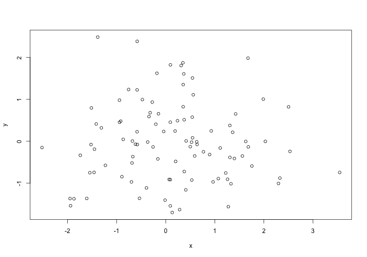
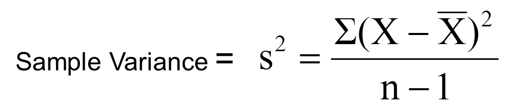

Automating everything: we should always strive for it!
========================================================
author: Jorge Cimentada  
date: 9th of March 2017  
class: illustration
font-family: 'Helvetica'
width: 1800
height: 900


Functions in R
========================================================


```r
my_name <- function(first_name, last_name) {
  paste(first_name, last_name, collapse = "")
}

my_name("Jorge", "Cimentada")
```

```
[1] "Jorge Cimentada"
```
  
- You need to pick a name for the function.
- You list the inputs, or arguments, to the function inside function.
- You place the code you have developed in body of the function.  


#### When should you write a function?
Write a function whenever you’ve copied and pasted a block of code more than twice.

Functions in R
========================================================

Functions can be used within other functions:


```r
my_profile <- function(first_name, last_name, age) {
  paste(my_name(first_name, last_name), "is", age, "years old", collapse = "")
}

my_profile("Jorge", "Cimentada", 26)
```

```
[1] "Jorge Cimentada is 26 years old"
```

Functions in R
========================================================

There are a couple of rules that you need to follow when creating functions.

- Everything that happens inside a function (almost) always stays inside a function


```r
random_num_generator <- function() {
  x <- rnorm(100)
  y <- rnorm(100)
  
  plot(x, y)
}

random_num_generator()
```


Run this and try searching for `x` or `y` inside your working directory.

Functions in R
========================================================

Everytime you call a function, everything that is created inside the function belongs to that functions environment.

Our GlobalEnvironment

```r
environment()
```

```
<environment: R_GlobalEnv>
```

The environment inside a function (randomly generated)

```r
function_env <- function() {
  environment()
}

function_env()
```

```
<environment: 0x7fc45d79d478>
```

After the function ends the new environment is automatically destroyed.

Functions in R
========================================================

Functions created in an interactive R session are stored by default in the `Global Environment`.


```r
our_useless_fun <- function() {
  "Our random function"
}
environment(our_useless_fun)
```

```
<environment: R_GlobalEnv>
```

How can you tell whether something is a function?


```r
class(our_useless_fun)
```

```
[1] "function"
```

```r
class(our_useless_fun())
```

```
[1] "character"
```

Functions in R
========================================================
**Name masking**

Remember this function?

```r
random_num_generator <- function() {
  x <- rnorm(100)
  y <- rnorm(100)
  
  plot(x, y)
}
```

- The function will search for `x` and `y` inside the functions environment.
- If it doesn't find it, it will look for the function in the next environment _higher_ up.

Functions in R
========================================================


```r
x <- rnorm(100)
random_num_generator <- function() {
  y <- rnorm(100)
  plot(x, y)
}
random_num_generator()
```



### How is the function doing the look up of the variables?

Functions in R
========================================================

Even harder:


```r
set.seed(1)
random_num_generator <- function() { 
  x <- rnorm(100)
  
  function() {
  y <- rnorm(100)
  plot(x, y)
  }
}

m <- random_num_generator()
m()
```

- Do we get an error?
- Whats the output like?

Functions in R
========================================================

Try this one:


```r
set.seed(1)
random_num_generator <- function() { 
  x <- rnorm(100)
  
  function() {
  y <- rnorm(100)
  }
  
  plot(x, y)
}

random_num_generator()
```

- Do we get an error?
- Whats the output like?

Functions in R
========================================================

Try this one:


```r
set.seed(1)
random_num_generator <- function() { 
  x <- rnorm(100)
  y <- rnorm(100)
  
  our_plot <- function() {
  plot(x, y)
  }
  
  our_plot()
}

random_num_generator()
```

- Do we get an error?
- Whats the output like?

Functions in R
========================================================

Some simple rules:

- Functions will look for the required input _inside_ their environment.
- If they don't find it, they'll search in the _parent environment_.
- If they can't find it, they'll search in the _parent environment_ of the _parent environment_.

How do we we know which is parent of who?

```r
search()
```

```
 [1] ".GlobalEnv"        "package:knitr"     "package:stats"    
 [4] "package:graphics"  "package:grDevices" "package:utils"    
 [7] "package:datasets"  "package:methods"   "Autoloads"        
[10] "package:base"     
```

Functions in R
========================================================

We know how functions look up variables, but how do functions look up other functions?

__**Exactly the same way**__


```r
set.seed(1)

our_plot <- function(x, y) plot(x, y)

random_num_generator <- function() {
  x <- rnorm(100)
  y <- rnorm(100)
  our_plot(x, y)
}
```

It will search the environment of the function and look for `our_plot` and `rnorm`, if not found, it will look in the _parent environment_ and so on..

Functions in R
========================================================
Another rule:
- Everything created in a function gets deleted after the function ends.

_Run this twice_

```r
j <- function() {
  if (!exists("a")) {
    a <- 1
  } else {
    a <- a + 1
  }
  a
}

j()
j()
```


Example taken from: http://adv-r.had.co.nz/Functions.html

Functions in R
========================================================
Finally, a function *always* returns the last line of code unless specified otherwise.


```r
my_fun <- function(x) {
  rnorm(x)
  y <- x
}

my_fun(10)
```

Functions in R
========================================================
We get something in return, which is the last line, but remember that the `<-` operator doesn't print the results.

This way we can see the return of the function:

```r
print(my_fun(10))
```

```
[1] 10
```

What if we want to return some value from the middle of the function?

Functions in R
========================================================

We use the function `return()`


```r
our_range <- function(x) {
  if (length(x) == 1) {
    return(x)
  }
  print("This shouldn't print!")
  c(min(x), max(x))
}

our_range(1:10)
```

```
[1] "This shouldn't print!"
```

```
[1]  1 10
```

```r
our_range(5)
```

```
[1] 5
```

When `return()` is used, the function only runs until `return()` and simply returns that value.

Functions in R
========================================================

Let's get some practice. This is how you calculate the variance of a series of numbers. 

<div align="center">

</div>  
  
  
### Let's start with everything inside the parethesis of the numerator

Functions in R
========================================================

- Create a vector called `x` which has a `rnorm(100)` inside. With this we'll generate `100` random numbers with a normal distribution.  

- Let's subtract each `x` from the `mean(x)`. This will give us the deviations from the overall mean.  

- Understand the contents of `x - mean(x)`

Functions in R
========================================================
### Answer:


```r
set.seed(1)
x <- rnorm(100)
x - mean(x)
```

```
  [1] -0.73534118  0.07475596 -0.94451598  1.48639344  0.22062040
  [6] -0.92935575  0.37854169  0.62943734  0.46689398 -0.41427575
 [11]  1.40289380  0.28095587 -0.73012795 -2.32358725  1.01604355
 [16] -0.15382098 -0.12507763  0.83494884  0.71233383  0.48501395
 [21]  0.81009000  0.67324893 -0.03432238 -2.09823906  0.51093838
 [26] -0.16501611 -0.26468287 -1.57963975 -0.58703742  0.30905419
 [31]  1.24979218 -0.21167509  0.27878424 -0.16269241 -1.48594692
 [36] -0.52388193 -0.50317732 -0.16820076  0.99113801  0.65428838
 [41] -0.27341096 -0.36224905  0.58807601  0.44777583 -0.79764306
 [46] -0.81638252  0.25569460  0.65964556 -0.22123358  0.77222036
 [51]  0.28921851 -0.72091376  0.23223232 -1.23825046  1.32413633
 [56]  1.87151253 -0.47610884 -1.15302199  0.46083226 -0.24394197
 [61]  2.29273039 -0.14812737  0.58085200 -0.08088521 -0.85216058
 [66]  0.07990493 -1.91384600  1.35666749  0.04436597  2.06372430
 [71]  0.36662216 -0.81883380  0.50183899 -1.04298500 -1.36252077
 [76]  0.18255887 -0.55217924 -0.10778202 -0.03454604 -0.69840831
 [81] -0.67755610 -0.24406598  1.06919963 -1.63245417  0.48505882
 [86]  0.22406300  0.95421247 -0.41307129  0.26113144  0.15821142
 [91] -0.65140740  1.09898044  1.05151525  0.59132628  1.47794609
 [96]  0.44959906 -1.38547958 -0.68215278 -1.33349998 -0.58228800
```

- Wrap `x - mean(x)` in parenthesis and raise it to the second power (`^2`)
- Wrap the previous expression in the `sum()` function to get the sum of squared deviations.
- Save that expression with the name `deviance_sq`.

Functions in R
========================================================
#### Answer:


```r
set.seed(1)
x <- rnorm(100)
deviance_sq <- sum((x - mean(x)) ^ 2)
```

We have the numerator done! Let's finish the denominator.

- Take the `length` of `x` minus `1` and save it with a name `denominator`.


Functions in R
========================================================
#### Answer:


```r
set.seed(1)
x <- rnorm(100)
deviance_sq <- sum((x - mean(x)) ^ 2)
denominator <- length(x) - 1
```

Let's finish the formula by dividing `deviance_seq` by the `denominator`.

Functions in R
========================================================
### Answer:


```r
set.seed(1)
x <- rnorm(100)
deviance_sq <- sum((x - mean(x)) ^ 2)
denominator <- length(x) - 1

our_result <- deviance_sq / denominator
```

Let's confirm that our results are correct:


```r
c(our_result = our_result, R_result = var(x))
```

```
our_result   R_result 
 0.8067621  0.8067621 
```

Functions in R
========================================================

Now comes the cool part! Lets wrap that into a function.

The skeleton of a function is:


```r
your_function_name <- function(your_argument1, your_argument2, etc..) {
  Body of the function
}
```

- Call your function `our_variance`
_ Set `x` as the first and only argument of the function.
- Include the calculate of `deviance_sq` and `denominator` in the body of the function
- Make sure to return `deviance_sq / denominator` as the last line in your function (without saving it to any name)

Functions in R
========================================================
### Answer:


```r
our_variance <- function(x) {
  
  deviance_sq <- sum((x - mean(x)) ^ 2)
  pen_length <- length(x) - 1
  
  deviance_sq / pen_length
}
```

- Save the function by running it either in the console or in the script.
- Try it out!


```r
set.seed(2)
x <- rnorm(100)
our_variance(x); var(x)
```

```
[1] 1.34604
```

```
[1] 1.34604
```

- Extend this to create the standard deviation
- Extend this to create a confidence interval variable that returns either both bounds or the chosen bound.
- Introduce loops (VERY briefly) and then the map function with vectors (by puting functions as the varying values)
- Extend map to dataframes and lists (this is when you include your PISA examples.)
- Introduce linear and non-linear modeling with the pipe and broom.
- Visualize one example of model for each country.

