ggplot2: The grammar of graphics
========================================================
author: Jorge Cimentada  
date: 2nd of March of 2017  
class: illustration
font-family: 'Helvetica'
width: 1800
height: 900


The grammar of graphics
========================================================

ggplot2 is designed to work in a layered fashion, starting with a layer showing the raw data then adding layers of annotations and statistical summaries.

- Data points are mapped with aesthetic attributes (colour, shape, size) of geometric objects (points, lines, bars).

- The plot is a _transformation_ of the data and is drawn on a coordinate system.

- Faceting can be used to generate the same plot for different subsets of the dataset.

## It is the combination of these independent components that make up a graphic.

Wilkinson, Leland. "Statistics." The Grammar of Graphics (2005): 111-154.  
Wickham, Hadley. ggplot2: elegant graphics for data analysis. Springer, 2016.

Plots adaptable objects
========================================================
Briefly preparing the data:


```r
library(fivethirtyeight)
library(tidyverse)

region_states <- setNames(as.character(state.region), state.name)
division_states <- setNames(as.character(state.division), state.name)

upd_bad_drivers <-
  bad_drivers %>%
  filter(state != "District of Columbia") %>% # For some reason this state is not in both data sets
  mutate(region = region_states[state],
         division = division_states[state])
```

Plots adaptable objects
========================================================
Let's explain each component of the grammar of graphics.

Data points:

```r
upd_bad_drivers %>%
  select(perc_speeding, perc_alcohol) %>%
  head(5)
```

```
# A tibble: 5 × 2
  perc_speeding perc_alcohol
          <int>        <int>
1            39           30
2            41           25
3            35           28
4            18           26
5            35           28
```

In this case, each perc_speeding has a paired perc_alcohol with can be united in a coordinate system.

Plots adaptable objects
========================================================
Coordinate system:


```r
upd_bad_drivers %>%
  ggplot(aes(x = perc_speeding, y = perc_alcohol))
```

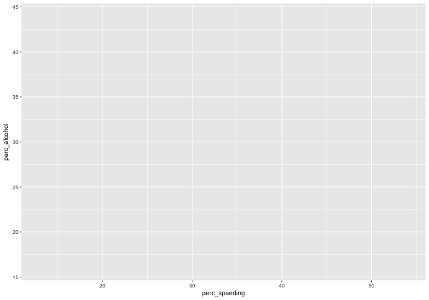

In this case, we're plotting a Cartesian coordinate system but there are others like the polar coordinates or map coordinates.

Plots adaptable objects
========================================================
Geometric objects:


```r
upd_bad_drivers %>%
  ggplot(aes(x = perc_speeding, y = perc_alcohol)) +
  geom_point()
```

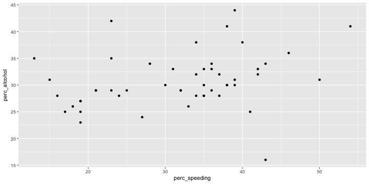
- The data points
- The empty coordinate system
- How do we represent the data points in the coordinate system? With a `geom_*` object.

Plots adaptable objects
========================================================
Aesthetic attributes:

Aesthetic attributes of the geometric objects can be things like:
- alpha (transparency)
- colour
- fill
- group
- shape
- size
- stroke (of a line)

Plots adaptable objects
========================================================
Aesthetic attributes:


```r
upd_bad_drivers %>%
  ggplot(aes(x = perc_speeding, y = perc_alcohol)) +
  geom_point(colour = "blue") 
```

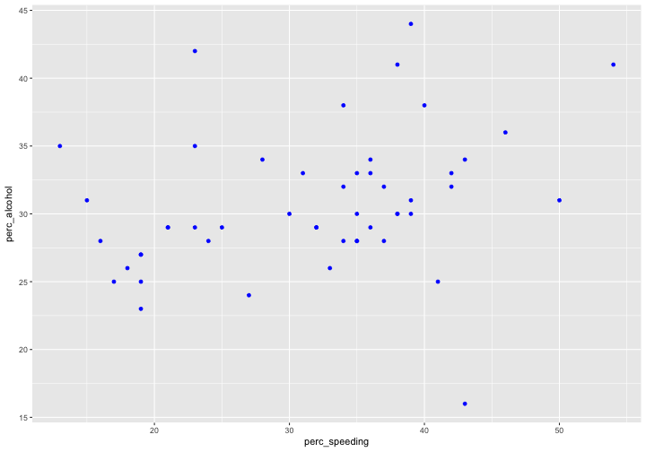

Plots adaptable objects
========================================================
Aesthetic attributes:


```r
upd_bad_drivers %>%
  ggplot(aes(x = perc_speeding, y = perc_alcohol)) +
  geom_point(aes(colour = region))
```

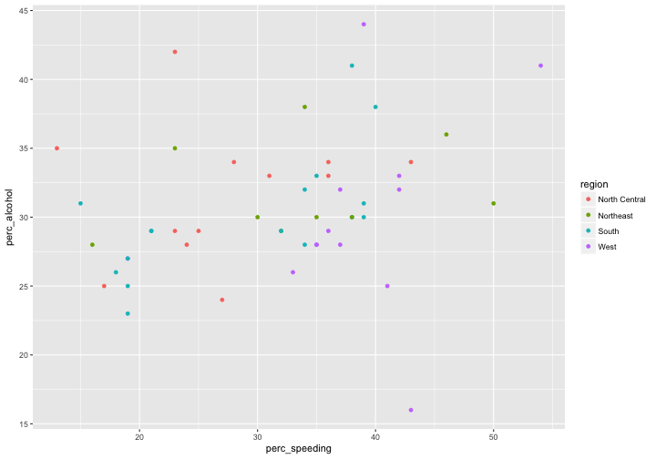

Plots adaptable objects
========================================================
All `geom_*()` have a set of attributes which by default are set a constant value.


```r
upd_bad_drivers %>%
  ggplot(aes(x = perc_speeding, y = perc_alcohol)) +
  geom_point()
```

This plot has a predetermined `colour`, `shape`, `size` and `transparency`. We can change it for another constant value or we can make the `aes`thetic as a function of another `variable`.

Plots adaptable objects
========================================================

Behind the scenes ggplot turns this data:

```
# A tibble: 5 × 2
  perc_speeding perc_alcohol
          <int>        <int>
1            39           30
2            41           25
3            35           28
4            18           26
5            35           28
```

into: 

```
   x  y PANEL group shape colour size fill alpha stroke
1 39 30     1    -1    19  black  1.5   NA    NA    0.5
2 41 25     1    -1    19  black  1.5   NA    NA    0.5
3 35 28     1    -1    19  black  1.5   NA    NA    0.5
4 18 26     1    -1    19  black  1.5   NA    NA    0.5
5 35 28     1    -1    19  black  1.5   NA    NA    0.5
```

Plots adaptable objects
========================================================

- The _aes_ inside `ggplot` is short for aesthetics  
- Each aesthetic can be mapped to another variable (in which case this aesthetic needs to be inside the `aes` function) or;
- Each aesthetic can be mapped to a constant value (in which case this aesthetic needs to be outside the `aes` function)


```r
upd_bad_drivers %>%
  ggplot(aes(x = perc_speeding, y = perc_alcohol)) +
  geom_point(colour = "blue") 

upd_bad_drivers %>%
  ggplot(aes(x = perc_speeding, y = perc_alcohol)) +
  geom_point(aes(colour = region))
```

Plots adaptable objects
========================================================
Statistical transformations:

```r
upd_bad_drivers %>%
  ggplot(aes(x = perc_speeding, y = perc_alcohol)) +
  geom_smooth(method = "lm")
```

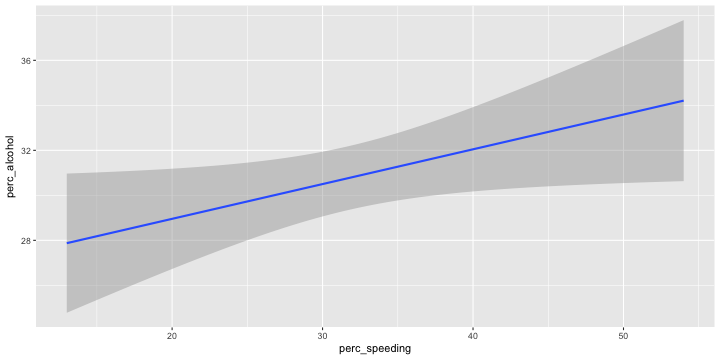
- `geom_point()` doesn't perform any transformation as it only places points in the coordinate system.  
- `geom_smooth()` performs a statistical transformation, usually a linear model or a lowess function.

Plots adaptable objects
========================================================

Behind the scenes `geom_smooth()` turns this data:

```
# A tibble: 3 × 2
  perc_speeding perc_alcohol
          <int>        <int>
1            39           30
2            41           25
3            35           28
```
into: 

```
         x        y     ymin     ymax       se PANEL group  colour   fill
1 13.00000 29.68310 22.94103 36.42518 3.346888     1    -1 #3366FF grey60
2 13.51899 29.53649 23.42741 35.64557 3.032657     1    -1 #3366FF grey60
3 14.03797 29.40007 23.88131 34.91883 2.739612     1    -1 #3366FF grey60
  size linetype weight alpha
1    1        1      1   0.4
2    1        1      1   0.4
3    1        1      1   0.4
```

Plots adaptable objects
========================================================
Statistical transformations:

Each `geom_*()` object is supported by a `stat_*()` function that transforms the data in a suitable format for the `geom_()` object.

For example, `stat_smooth()` is the one carrying out the transformation of the data. Check `?stat_smooth` for more details.

We could do this:

```r
upd_bad_drivers %>%
  ggplot(aes(x = perc_speeding, y = perc_alcohol)) +
  stat_smooth(method = "lm")
```


Plots adaptable objects
========================================================
#### Faceting:

Is the process in which the same graph is reproduced for subsets of the data.


```r
upd_bad_drivers %>%
  ggplot(aes(x = perc_speeding, y = perc_alcohol)) +
  geom_smooth(method = "lm") +
  facet_wrap(~ region)
```

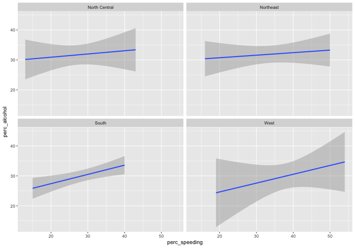

Plots adaptable objects
========================================================
Together, the `data`, `aes`thetics `stat_*`, `geom_*` and `faceting` form a layer.

The grammar of graphics allows you overlap layers in a way that makes sense for your specific problems. Let's look at a simple example.


```r
upd_bad_drivers %>%
  ggplot(aes(x = perc_speeding, y = perc_alcohol)) +
  geom_point()
```


... forms a layer of points.

Plots adaptable objects
========================================================


```r
upd_bad_drivers %>%
  ggplot(aes(x = perc_speeding, y = perc_alcohol)) +
  geom_smooth(method = "lm")
```

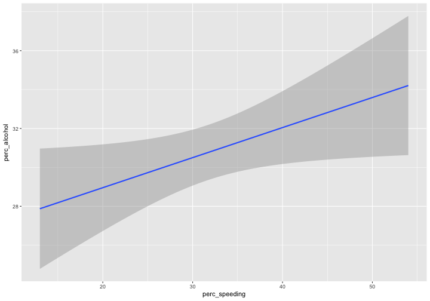

... forms a layer of a regression line. 

Plots adaptable objects
========================================================

Note that both these layers have the same two `x` and `y` variables. This makes it very easy to _overlay_ the two layers.


```r
upd_bad_drivers %>%
  ggplot(aes(x = perc_speeding, y = perc_alcohol)) +
  geom_point() +
  geom_smooth(method = "lm")
```


Plots adaptable objects
========================================================
Look at this plot with two layers:


```r
regionline <-
  upd_bad_drivers %>%
  group_by(region) %>%
  summarize(region_mean = median(perc_speeding))

ggplot() +
  geom_point(data = upd_bad_drivers, aes(region, perc_speeding)) +
  geom_line(data = regionline, aes(region, region_mean, group = 1), colour = "red", size = 0.5)
```


Plots adaptable objects
========================================================
Let's break it down.

First, set the `ggplot()` call.

```r
(graph <- ggplot())
```


This function initializes a ggplot object. Note that no coordinate has been mapped and only a grey plane is produced.

Plots adaptable objects
========================================================

Next, we can add a `geom_point()` object.

```r
(graph <- graph + geom_point())
```


This new `geom` has no `data` or `aes`thetics. We can keep constructing the plot with each new concept.

Plots adaptable objects
========================================================
We add the `data` with the %+% operator (to add ggplot objects with each other) and the `aes`thetic containing the variables.


```r
(graph <- graph %+% upd_bad_drivers + aes(x = region, y = perc_speeding))
```

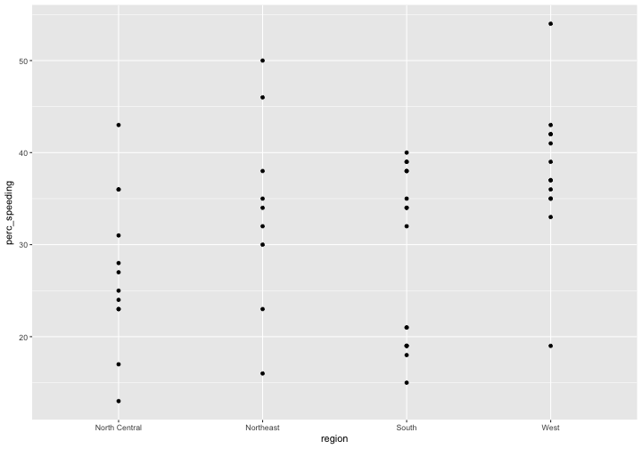

Plots adaptable objects
========================================================

At this point we have the graph we wanted. This is one layer and a complete plot. Following the grammar of graphics we can continue to add overlaying plots. 


```r
(graph <- graph +
  geom_line(data = regionline, aes(region, region_mean, group = 1), colour = "red"))
```


This plot reproduces the previous graph we saw before. But we can continue adding endless plots.

Plots adaptable objects
========================================================

What if we wanted to add a sort of confidence interval for the regional mean?
`geom_linerage` is a `geom` the accepts an `x` variable (`region` in our case) and a `ymin` and `ymax` `aes`thetic where it will draw the error bar. 

We just need to construct a data frame that has the upper and lower bounds for each region. We know `dplyr`, so this easy!


```r
(confidence_bad_drivers <-
  upd_bad_drivers %>%
  group_by(region) %>%
  summarize(ymin = mean(perc_speeding) - 2 * sd(perc_speeding),
            ymax = mean(perc_speeding) + 2 * sd(perc_speeding)))
```

```
# A tibble: 4 × 3
         region     ymin     ymax
          <chr>    <dbl>    <dbl>
1 North Central 10.37201 43.96133
2     Northeast 12.78307 54.77249
3         South 10.03352 47.59148
4          West 22.29273 53.55342
```

Plots adaptable objects
========================================================

What would the plot look like on its own?


```r
confidence_bad_drivers %>%
  ggplot() +
  geom_errorbar(aes(x = region, ymin = ymin, ymax = ymax)) +
  geom_point(data = upd_bad_drivers, aes(x = region, y = perc_speeding))
```

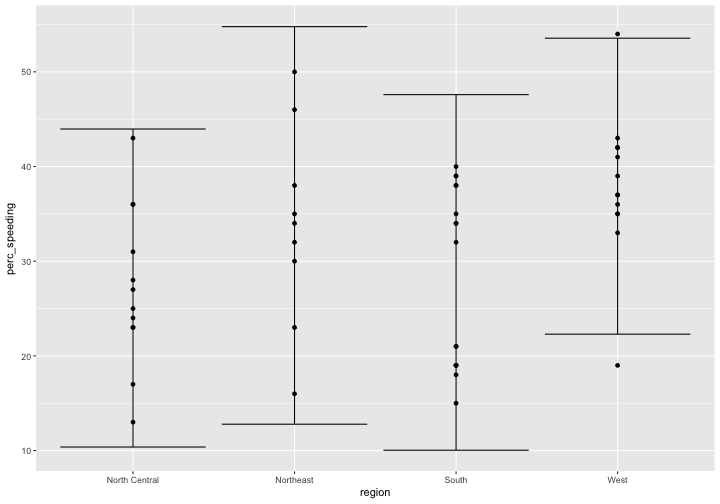
Let's add it to the previous plot.

Plots adaptable objects
========================================================


```r
(graph <- graph +
   geom_errorbar(data = confidence_bad_drivers,
                 aes(x = region, y = NULL, ymin = ymin, ymax = ymax), colour = 'blue'))
```

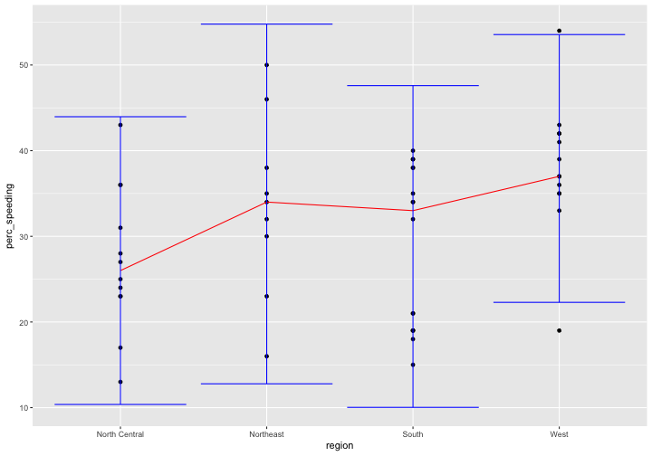

Why did we assign `y` to `NULL` when `geom_errorbar` doesn't use a `y` `aes`thetics. Try removing the `y` argument.

But that might be a mistake..it's passing the global `y` to an unexistent `y` `aes`thetic. See [here](https://stackoverflow.com/questions/42491913/ggplot2-asking-for-a-non-existent-aesthetic-in-geom-errorbar)

Plots adaptable objects
========================================================

All we did was equivalent to saying:


```r
regionline <-
  upd_bad_drivers %>%
  group_by(region) %>%
  summarize(region_mean = median(perc_speeding),
            ymin = region_mean - 2 * sd(perc_speeding),
            ymax = region_mean + 2 * sd(perc_speeding))

ggplot() +
  geom_point(data = upd_bad_drivers, aes(region, perc_speeding)) +
  geom_line(data = regionline, aes(region, region_mean, group = 1), colour = "red") +
  geom_errorbar(data = regionline, aes(region, ymin = ymin, ymax = ymax), colour = 'blue')
```


Plots adaptable objects
========================================================

Next slide is the graph.


Plots adaptable objects
========================================================

To finish on layering, let's understand how each layer does data and aesthetics lookup.


```r
ggplot() +
  geom_point(data = upd_bad_drivers, aes(region, perc_speeding)) +
  geom_line(data = regionline, aes(region, region_mean, group = 1), colour = "red") +
  geom_errorbar(data = regionline, aes(region, ymin = ymin, ymax = ymax), colour = 'blue')
```

Each `geom` has their own `data` and `aes` argument specified plus other `aes`thetics mapped to constant values.

What would happen if I deleted the `colour` aesthetic from `geom_line` and moved `aes(colour = "red")` to the `ggplot()` call? Run this yourself.

Plots adaptable objects
========================================================


```r
ggplot(mapping = aes(colour = "red")) +
  geom_point(data = upd_bad_drivers, aes(region, perc_speeding)) +
  geom_line(data = regionline, aes(region, region_mean, group = 1)) +
  geom_errorbar(data = regionline, aes(region, ymin = ymin, ymax = ymax), colour = 'blue')
```


Now, try deleting `data = regionline` from both `geom_line` and `geom_errorbar` and only including it in `ggplot()`.

Plots adaptable objects
========================================================


```r
ggplot(data = regionline, mapping = aes(colour = "red")) +
  geom_point(data = upd_bad_drivers, aes(region, perc_speeding)) +
  geom_line(aes(region, region_mean, group = 1)) +
  geom_errorbar(aes(region, ymin = ymin, ymax = ymax), colour = 'blue')
```

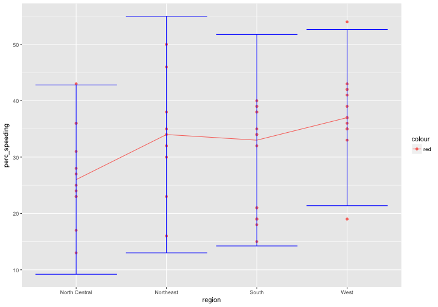

Let's end by removing `region` from each of the `aes` calls and specifying it in the `ggplot` call. Remember to specify all the remaining `y` variables with the `y =` argument.

Plots adaptable objects
========================================================


```r
ggplot(data = regionline, mapping = aes(x = region, colour = "red")) +
  geom_point(data = upd_bad_drivers, aes(y = perc_speeding)) +
  geom_line(aes(y = region_mean, group = 1)) +
  geom_errorbar(aes(ymin = ymin, ymax = ymax), colour = 'blue')
```


Plots adaptable objects
========================================================

Let's establish some general rules.

- Everything specified in the `ggplot()` is automatically passed to every chained `geom`.

- If something is specified in the `geom`, but also was specified in `ggplot()`, `geom` will overwrite the options _for that_ `geom`.

- Specifying options in `ggplot()` (like moving our `data` argument and the `region` variable) is a good idea because it avoids verbose code and the DRY (Don't Repeat Yourself) principle.

- Each `geom` can have independent options from other geoms, allowing for full layer customization.

Different types of plots in ggplot2
========================================================

How many geoms (plots)?

- geom_point()
- geom_bar()
- geom_histogram()
- geom_boxplot()
- geom_density()
- geom_line()
- geom_smooth()
- And a bunch more

See [here](http://sape.inf.usi.ch/quick-reference/ggplot2/geom)

Different types of plots in ggplot2
========================================================

Next on make each of these graph and learn about legends, scales, axes and titles.

Since we already generated some scatterplots, let's start with a barplot.

- Barplots count the frequency of cases within a categorical variable. We can safely assume that `geom_bar` accepts one required `aes`thetic, an `x`. 

With what you've been introduced, you're capable enough of creating the plot.

Hint:
`data` = `upd_bad_drivers`  
`x` = `division`  
`geom_bar()`

Remember to set _all_ of these options as 'global' parameters in the ggplot chain.

Different types of plots in ggplot2
========================================================


```r
ggplot(upd_bad_drivers, aes(x = division)) +
  geom_bar()
```

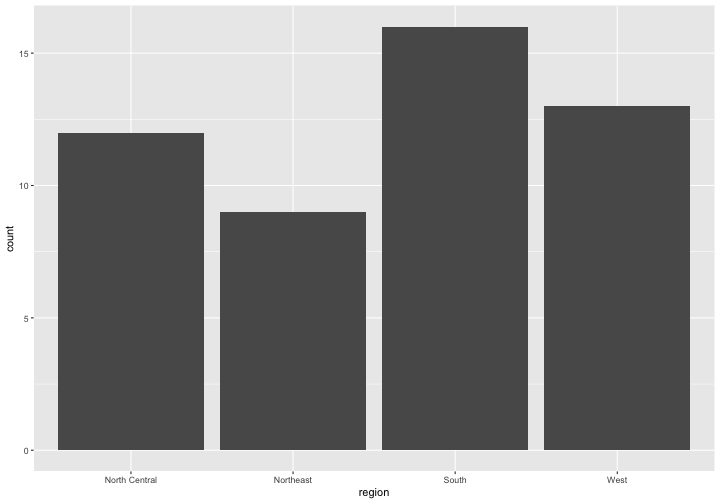

We wanna give each of the bars a different `fill` and then set the transparency (`alpha`) to `0.4`. Remember you'll be specifying two `aes`thetics but the first one mapped to a `variable` while the second to a constant value.

Different types of plots in ggplot2
========================================================


```r
ggplot(upd_bad_drivers, aes(x = division, fill = division), alpha = 0.4) +
  geom_bar()
```

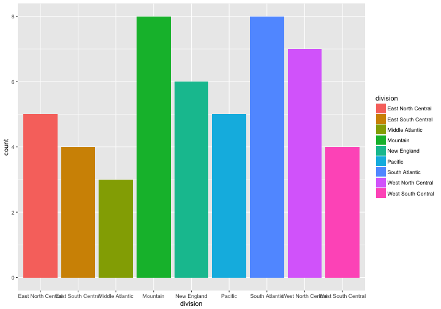

Oops..why is this wrong?

Different types of plots in ggplot2
========================================================
Another caveat: if the `aes`thetic is set to a constant value, then it needs to be specified inside a `geom` object.


```r
ggplot(upd_bad_drivers, aes(x = division, fill = division)) +
  geom_bar(alpha = 0.4)
```

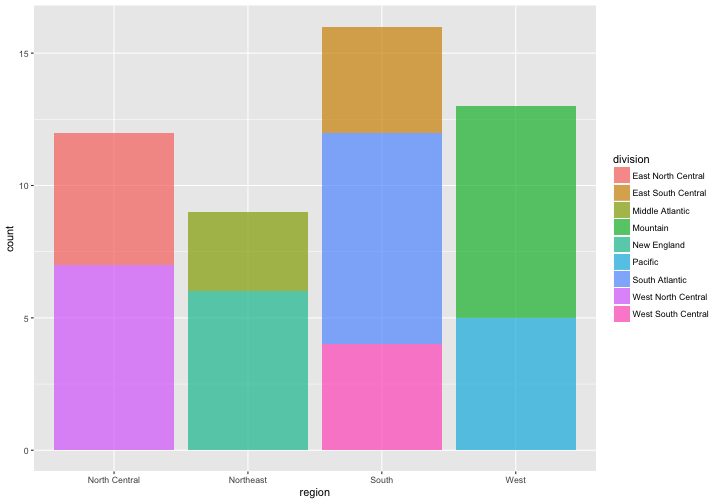

Different types of plots in ggplot2
========================================================

The legend title looks a bit ugly, lets change that. We can do that with the `scale_*_*` functions.

Answer these two questions:
- To which `aes`thetic attribute does the legend belong to?
- What _type_ of variable is our `fill` variable? i.e. ratio, continuous, categorical, etc..

In that same order, type `scale_yourfirstanswer_yoursecondanswer`. That function controls all the options of that attribute. Let's dive into what the function does.

Different types of plots in ggplot2
========================================================

`scale_fill_discrete()` was the correct answer!

What can we control with this function?
discrete_scale(
aesthetics,
scale_name,
palette,
name = waiver(),
breaks = waiver(),
labels = waiver(),
limits = NULL,
expand = waiver(),
na.translate = TRUE,
na.value = NA,
drop = TRUE,
guide = "legend",
position = "left",
super = ScaleDiscrete)

How to change specific legend colours?
How to combine two legends into one?
How to move X or Y labels into horizontal or vertical.
